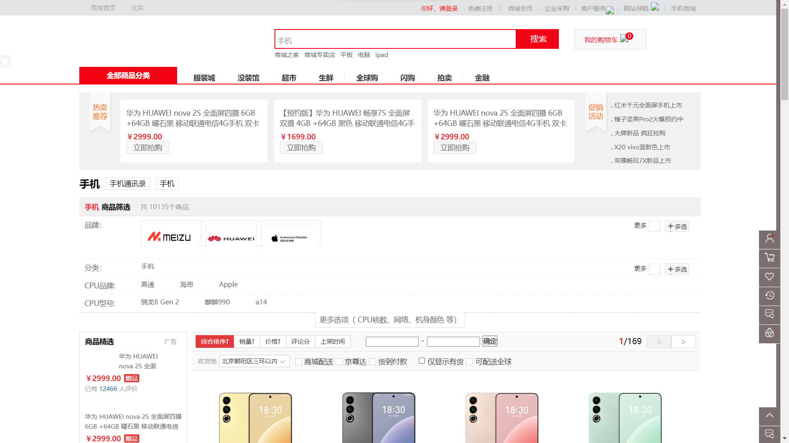
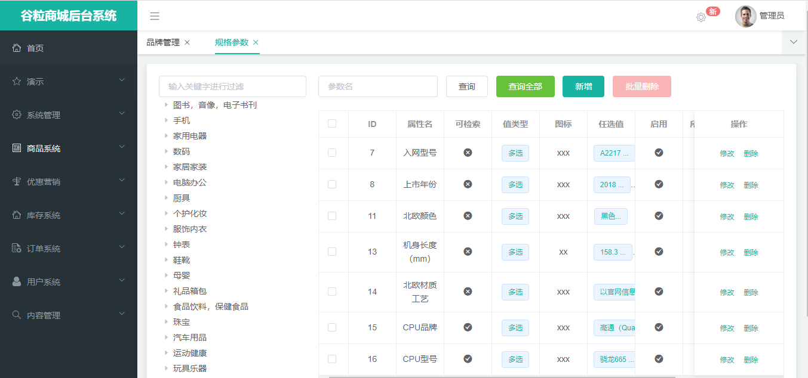
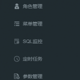
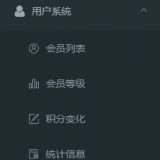
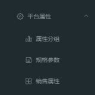
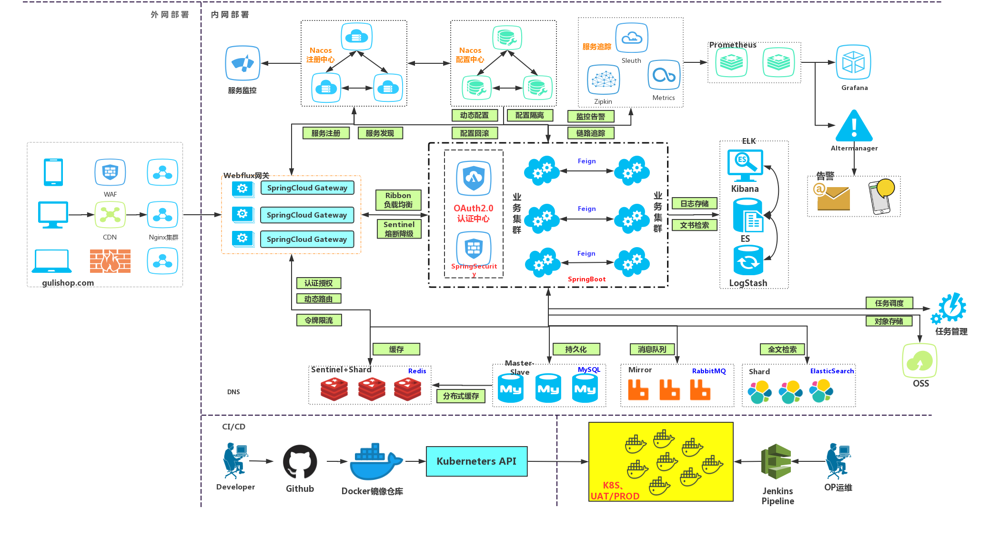
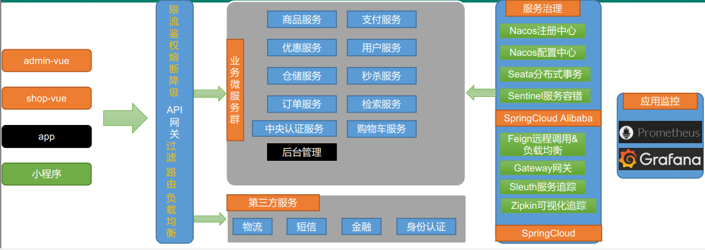

# 商城简介

### 前言

gulimall 项目致力于打造一个完整的电商系统，采用现阶段流行技术来实现，采用前后端分离继续编写。

### 项目API接口文档

- 文档地址：[https://easydoc.xyz/s/78237135/ZUqEdvA4/hKJTcbfd]()

### 项目介绍

gulimall 项目是一套电商项目，包括前台商城系统以及后台管理系统，基于 SpringCloud + SpringCloudAlibaba + MyBatis-Plus实现，采用
Docker 容器化部署。前台商城系统包括：用户登录、注册、商品搜索、商品详情、购物车、下订单流程、秒杀活动等模块。后台管理系统包括：系统管理、商品系统、优惠营销、库存系统、订单系统、用户系统、内容管理等七大模块。

### 项目演示
换了一下 logo (京东，谷粒) ──>京粒
#### **前台部分功能演示效果**




#### 后端登录界面


#### 主页面



#### 后台部分功能

[](https://gitee.com/link?target=https%3A%2F%2Fimgchr.com%2Fi%2FUUvoXq)[](https://gitee.com/link?target=https%3A%2F%2Fimgchr.com%2Fi%2FUUvONF)[](https://gitee.com/link?target=https%3A%2F%2Fimgchr.com%2Fi%2FUUvHBV)[](https://gitee.com/link?target=https%3A%2F%2Fimgchr.com%2Fi%2FUUvIcn)

### 组织结构

```
gulimall
├── cloud-guli-auth -- 认证中心（社交登录、OAuth2.0、单点登录）
├── cloud-guli-cart -- 购物车服务
├── cloud-guli-fast -- 后台管理
├── cloud-guli-gateway -- 统一配置网关
├── cloud-guli-member -- 会员服务
├── cloud-guli-order -- 订单服务
├── cloud-guli-product -- 商品服务
├── cloud-guli-search -- 检索服务
├── cloud-guli-seckill -- 秒杀服务
├── cloud-guli-third-service -- 第三方服务
├── cloud-guli-ware -- 仓储服务
├── cloud-guli-yhq -- 优惠卷服务
├── gulimall-common -- 工具类及通用代码
├── renren-generator -- 人人开源项目的代码生成器
├── unionpay-spring-boot-starter -- 整合银联支付场景启动器
```

### 技术选型

**后端技术**

| 技术                 | 说明           | 官网                                                                                                                                         |
|--------------------|--------------|--------------------------------------------------------------------------------------------------------------------------------------------|
| SpringBoot         | 容器+MVC框架     | [https://spring.io/projects/spring-boot](https://gitee.com/link?target=https%3A%2F%2Fspring.io%2Fprojects%2Fspring-boot)                   |
| SpringCloud        | 微服务架构        | [https://spring.io/projects/spring-cloud](https://gitee.com/link?target=https%3A%2F%2Fspring.io%2Fprojects%2Fspring-cloud)                 |
| SpringCloudAlibaba | 一系列组件        | [https://spring.io/projects/spring-cloud-alibaba](https://gitee.com/link?target=https%3A%2F%2Fspring.io%2Fprojects%2Fspring-cloud-alibaba) |
| MyBatis-Plus       | ORM框架        | [https://mp.baomidou.com](https://gitee.com/link?target=https%3A%2F%2Fmp.baomidou.com)                                                     |
| renren-generator   | 人人开源项目的代码生成器 | https://gitee.com/renrenio/renren-generator                                                                                                |
| Elasticsearch      | 搜索引擎         | [https://github.com/elastic/elasticsearch](https://gitee.com/link?target=https%3A%2F%2Fgithub.com%2Felastic%2Felasticsearch)               |
| RabbitMQ           | 消息队列         | [https://www.rabbitmq.com](https://gitee.com/link?target=https%3A%2F%2Fwww.rabbitmq.com)                                                   |
| Springsession      | 分布式缓存        | [https://projects.spring.io/spring-session](https://gitee.com/link?target=https%3A%2F%2Fprojects.spring.io%2Fspring-session)               |
| Redisson           | 分布式锁         | [https://github.com/redisson/redisson](https://gitee.com/link?target=https%3A%2F%2Fgithub.com%2Fredisson%2Fredisson)                       |
| Docker             | 应用容器引擎       | [https://www.docker.com](https://gitee.com/link?target=https%3A%2F%2Fwww.docker.com)                                                       |
| OSS                | 对象云存储        | [https://github.com/aliyun/aliyun-oss-java-sdk](https://gitee.com/link?target=https%3A%2F%2Fgithub.com%2Faliyun%2Faliyun-oss-java-sdk)     |

**前端技术**

| 技术        | 说明     | 官网                                                                                         |
|-----------|--------|--------------------------------------------------------------------------------------------|
| Vue       | 前端框架   | [https://vuejs.org](https://gitee.com/link?target=https%3A%2F%2Fvuejs.org)                 |
| Element   | 前端UI框架 | [https://element.eleme.io](https://gitee.com/link?target=https%3A%2F%2Felement.eleme.io)   |
| thymeleaf | 模板引擎   | [https://www.thymeleaf.org](https://gitee.com/link?target=https%3A%2F%2Fwww.thymeleaf.org) |
| node.js   | 服务端的js | [https://nodejs.org/en](https://gitee.com/link?target=https%3A%2F%2Fnodejs.org%2Fen)       |

### 架构图

**系统架构图**

[](https://gitee.com/link?target=https%3A%2F%2Fimgchr.com%2Fi%2FUUvRAS)

**业务架构图**



### 环境搭建

#### 开发工具

| 工具            | 说明           | 官网                                                                                                                         |
|---------------|--------------|----------------------------------------------------------------------------------------------------------------------------|
| IDEA          | 开发Java程序     | [https://www.jetbrains.com/idea/download](https://gitee.com/link?target=https%3A%2F%2Fwww.jetbrains.com%2Fidea%2Fdownload) |
| RedisDesktop  | redis客户端连接工具 | [https://redisdesktop.com/download](https://gitee.com/link?target=https%3A%2F%2Fredisdesktop.com%2Fdownload)               |
| SwitchHosts   | 本地host管理     | [https://oldj.github.io/SwitchHosts](https://gitee.com/link?target=https%3A%2F%2Foldj.github.io%2FSwitchHosts)             |
| FinalShell    | Linux远程连接工具  | [http://www.hostbuf.com/t/988.html](https://gitee.com/link?target=http://www.hostbuf.com/t/988.html)                       |
| Navicat       | 数据库连接工具      | [http://www.formysql.com/xiazai.html](https://gitee.com/link?target=http%3A%2F%2Fwww.formysql.com%2Fxiazai.html)           |
| PowerDesigner | 数据库设计工具      | [http://powerdesigner.de](https://gitee.com/link?target=http%3A%2F%2Fpowerdesigner.de)                                     |
| Postman       | API接口调试工具    | [https://www.postman.com](https://gitee.com/link?target=https%3A%2F%2Fwww.postman.com)                                     |
| Jmeter        | 性能压测工具       | [https://jmeter.apache.org](https://gitee.com/link?target=https%3A%2F%2Fjmeter.apache.org)                                 |
| Typora        | Markdown编辑器  | [https://typora.io](https://gitee.com/link?target=https%3A%2F%2Ftypora.io)                                                 |

#### 开发环境

| 工具             | 版本号         | 下载                                                                                                                                                                                                   |
|----------------|-------------|------------------------------------------------------------------------------------------------------------------------------------------------------------------------------------------------------|
| WSL            | Linux环境     | [https://learn.microsoft.com/zh-cn/windows/wsl/install](https://gitee.com/link?target=https://learn.microsoft.com/zh-cn/windows/wsl/install)                                                         |
| Docker Desktop | Docker桌面客户端 | [https://docs.docker.com/desktop/install/windows-install](https://gitee.com/link?target=https://docs.docker.com/desktop/install/windows-install)                                                     |
| JDK            | 1.8         | [https://www.oracle.com/java/technologies/javase/javase-jdk8-downloads.html](https://gitee.com/link?target=https%3A%2F%2Fwww.oracle.com%2Fjava%2Ftechnologies%2Fjavase%2Fjavase-jdk8-downloads.html) |
| Mysql          | 5.7         | [https://www.mysql.com](https://gitee.com/link?target=https%3A%2F%2Fwww.mysql.com)                                                                                                                   |
| Redis          | Redis       | [https://redis.io/download](https://gitee.com/link?target=https%3A%2F%2Fredis.io%2Fdownload)                                                                                                         |
| Elasticsearch  | 7.6.2       | [https://www.elastic.co/downloads](https://gitee.com/link?target=https%3A%2F%2Fwww.elastic.co%2Fdownloads)                                                                                           |
| Kibana         | 7.6.2       | [https://www.elastic.co/cn/kibana](https://gitee.com/link?target=https%3A%2F%2Fwww.elastic.co%2Fcn%2Fkibana)                                                                                         |
| RabbitMQ       | 3.8.5       | [http://www.rabbitmq.com/download.html](https://gitee.com/link?target=http%3A%2F%2Fwww.rabbitmq.com%2Fdownload.html)                                                                                 |
| Nginx          | 1.1.6       | [http://nginx.org/en/download.html](https://gitee.com/link?target=http%3A%2F%2Fnginx.org%2Fen%2Fdownload.html)                                                                                       |

注意：以上的除了jdk都是采用docker方式进行安装，详细安装步骤可参考百度!!!

#### 搭建步骤

> Windows环境部署

- 修改本机的host文件，映射域名端口(WSL环境与主机会共用端口)

```
#gulimall
localhost gulimall.com
localhost search.gulimall.com
localhost member.gulimall.com
localhost ware.gulimall.com
localhost item.gulimall.com
localhost auth.gulimall.com
localhost cart.gulimall.com
localhost order.gulimall.com
localhost seckill.gulimall.com
localhost third.gulimall.com
以上端口换成自己Linux的ip地址
```

- 修改Linux中Nginx的配置文件

```
1、在nginx.conf中添加负载均衡的配置    
	upstream gulimall{
		server host.docker.internal:6000;
	}
2、在conf.d目录下创建default.conf,gulimall.conf
   在default.conf中添加如下配置(转发支付宝支付回调)
server {
    listen       80;
    server_name  localhost;

    charset utf-8;
    access_log  logs/pass.access.log  main;
	
    location ^~ /paid/notify {
		proxy_pass http://gulimall;
		proxy_set_header Host third.gulimall.com;
    }
	
	location / {
		root   html;
		index  index.html index.htm;
     }
}

   在gulimall.conf中添加如下配置
server {
    listen       80;
    server_name  gulimall.com *.gulimall.com;

    charset utf-8;

    access_log  logs/gulimall.access.log  main;
	
    location / {
		proxy_pass http://gulimall;
		proxy_set_header Host $host;
    }
	
	#动静分离
	location ~* /static/.*/.*(image|libs|bootStrap|sass|scss|script|font|images|js|fonts|img|css|imgs)/*\w+ {
		root html;
	}
}
```

- 克隆前端项目 `renren-fast-vue` 以 `npm run dev` 方式去运行
- 克隆整个后端项目 `gulimall` ，并导入 IDEA 中完成编译
- 运行docker-compose up (可选)
