# JSR303介绍和使用

## 关于JSR

JSR是Java Specification [Requests](https://so.csdn.net/so/search?q=Requests&spm=1001.2101.3001.7020)的缩写，意思是Java
规范提案。是指向JCP(Java Community Process)提出新增一个标准化技术规范的正式请求。任何人都可以提交JSR，以向Java平台增添新的API和服务。JSR已成为Java界的一个重要标准。

## 关于 JSR-303

JSR-303 是JAVA EE 6 中的一项子规范，叫做Bean
Validation，[Hibernate](https://so.csdn.net/so/search?q=Hibernate&spm=1001.2101.3001.7020) Validator 是 Bean Validation
的参考实现 . Hibernate Validator 提供了 JSR 303 规范中所有内置 constraint 的实现，除此之外还有一些附加的 constraint。

### Hibernate 对其实现

Hibernate Validator 是 Bean Validation 的参考实现 . Hibernate Validator 提供了 JSR 303 规范中所有内置 constraint
的实现，除此之外还有一些附加的 constraint。

## 简单介绍

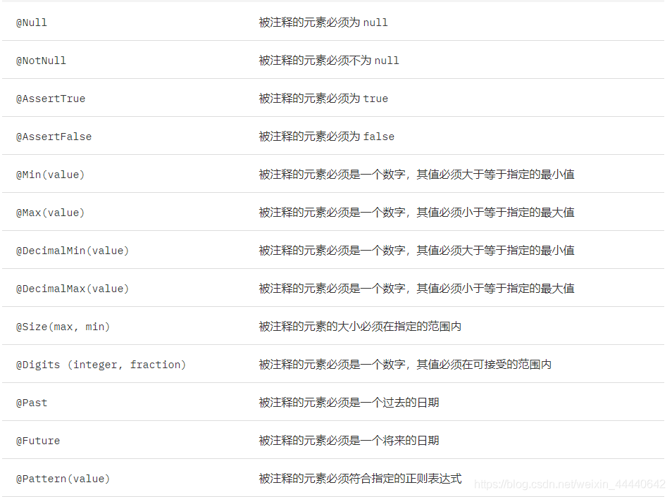

## 补充

Hibernate 中填充一部分
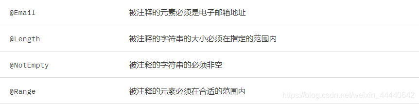

## 代码实现

### 依赖

```xml
<!-- https://mvnrepository.com/artifact/org.hibernate.validator/hibernate-validator -->
<dependency>
    <groupId>org.hibernate.validator</groupId>
    <artifactId>hibernate-validator</artifactId>
    <version>6.0.16.Final</version>
</dependency>
```

### (1)给要校验的javaBean上标注校验注解

```java

@ToString
@Getter
@Setter
public class UmsAdminParam {
    //规定长度
    @Length(min = 6, max = 19, message = "用户名长度是6-18位")
    @ApiModelProperty(value = "用户名", required = true)
    private String username;
    @ApiModelProperty(value = "密码", required = true)
    private String password;
    //不能是空的
    @NotEmpty
    @ApiModelProperty(value = "用户头像")
    private String icon;
    @Email(message = "邮箱格式错误")
    @ApiModelProperty(value = "邮箱")
    private String email;
    @NotNull
    @ApiModelProperty(value = "用户昵称")
    private String nickName;
    @ApiModelProperty(value = "备注")
    private String note;
}
```

### (2)告诉spring这个数据需要校验@Valid

### (3)感知校验成功/失败

```java
public Stringregister(@Valid @RequestBody UmsAdminParam user,BindingResult result){
        //得到所有错误信息计数
        int errorCount=result.getErrorCount();
        //错误数大于0
        if(errorCount>0){
        //得到所有错误
        List<FieldError> fieldErrors=result.getFieldErrors();
        //迭代错误
        fieldErrors.forEach((fieldError)->{
        //错误信息
        String field=fieldError.getField();
        log.debug("属性：{},传来的值是：{},出错的提示消息：{}",
        field,fieldError.getRejectedValue(),fieldError.getDefaultMessage());
        });
        return fieldError.getRejectedValue()+"出错:"+fieldError.getDefaultMessage();
        }else{
        return"登录成功";
        }
        }
```

# 分层领域模型规约

- DO(Data Object):此对象的属性与[数据库](https://cloud.tencent.com/solution/database?from=10680)表结构一一对应，通过 DAO
  层向上传输数据源对象。
- DTO(Data Transfer Object):数据传输对象，Service 或 Manager 向外传输的对象。
- BO(Business Object):业务对象，由 Service 层输出的封装业务逻辑的对象。
- AO(ApplicationObject):应用对象，在Web层与Service层之间抽象的复用对象模型， 极为贴近展示层，复用度不高。
- VO(View Object):显示层对象，通常是 Web 向模板渲染引擎层传输的对象。
- Query:数据查询对象，各层接收上层的查询请求。注意超过 2 个参数的查询封装，禁止使用 Map 类来传输。

领域模型命名规约：

- 数据对象：xxxDO，xxx即为数据表名
- 数据传输对象：xxxDTO，xxx为业务领域相关的名称。
- 展示对象：xxxVO，xxx一般为网页名称。
- POJO是DO/DTO/BO/VO的统称，禁止命名成xxxPOJO。

先看一张各个对象间的关系图，有个印象

然后，再来慢慢解释各个对象的作用。

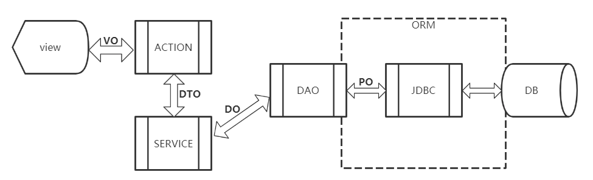

### **VO**

Value Object

用于表示前端的展示对象；相比与PO（数据库映射对象），VO对象与前端交互的数据可能需要经过过滤、拆分、聚合等操作；比方说部分不需要展示的数据，VO层将其踢出后返回；如果数据来源于多个地方，也将会在VO对象进行聚合再返回等操作；

遵循Java Bean的规范，其拥有getter / setter方法,对于请求的命名时可加上Req后缀,响应的可加上Rep后缀

### **DTO**

Data Transfer Object

数据传输对象；DTO主要协调于各个服务之间，用于做数据的扭转并传输；比如，数据库有20个字段，但实际业务只需要5个，那么就可以借助DTO对PO对象进行传输；避免数据库结构的暴露，并减少不必要的数据交互

遵循Java Bean的规范，其拥有getter / setter方法

### **BO**

Business Object

表示一个业务对象；BO包含了一些业务逻辑，通常用于封装对DAO、RPC等相关的调用，同时还可以进行PO、VO、DTO之间的数据转换；

BO通常都是位于业务层，并提供了基本的业务操作；在设计上属于被服务层业务逻辑调用的对象，一段业务的执行，可能需要多个BO对象的相互配合才能完成

### **PO**

persistant object

表示着Java对象与数据库之间的映射关系；其仅用于表示数据，并没有任何的数据操作；

遵循Java Bean的规范，其拥有getter / setter方法

### **DAO**

Data Access Object

通过Dao配合PO对象进行数据库访问，其中包含了增删改查等一系列的数据库操作，DAO一般在持久层，其完全封装了数据库的行为，并对外提供方法，上层通过他访问数据完全不需要关心数据库任何信息；

### **POJO**

Plain Ordinary Java Object 的缩写

表示一个简单 java 对象；只要遵循Java Bean的规范，并赋予getter / setter方法，就是一个POJO对象；

只是在不用的场景，不同的功能和定义下，POJO会演变为PO、VO、DTO等

# java.util.Optional

java.util.Optional是Java
8新增的类，作为一个持有实例的容器类，可以帮我们把判空的代码写得更优雅，并且该类还提供了一些实用的api，官方文档[在这里](http://docs.oracle.com/javase/8/docs/api/)
，接下来我们通过实战来学习吧:

### 三种Optional构造方法

第一种. Optional.of(Object object)：入参object不能为空，否则会抛出空指针异常，查看Optional源码发现会调用Objects.requireNonNull方法，里面有判空：

```java
public static<T> T requireNonNull(T obj){
        if(obj==null)
        throw new NullPointerException();
        return obj;
        }
```

第二种. Optional.ofNullable(Object object)：入参object可以为空，如果object不为空，就创建一个Optional实例；如果object为空就返回一个static
fainal的Option对象，注意这里不会新建Option实例，而是使用一个static
final的实例EMPTY，这里比较有意思的是泛型的问题，例如我需要两个Optional对象，类型分别是String和Integer，代码如下：

```java
Optional<String> optionalStr=Optional.ofNullable(null);
        Optional<Integer> optionalInt=Optional.ofNullable(null);
```

类型不同又如何保证返回同一个对象呢？直接看ofNullable的源码，发现会调用empty方法：

```java
public static<T> Optional<T> empty(){
@SuppressWarnings("unchecked")
        Optional<T> t=(Optional<T>)EMPTY;
        return t;
        }
```

原来是通过强制转换实现的，再看EMPTY对象：

```java
private static final Optional<?> EMPTY=new Optional<>();
```

是通过"?"声明的；

第三种. Optional.empty()：就是上面分析Optional.ofNullable的时候用到的empty方法，直接返回一个static final的实例EMPTY；

Optional.of()方法的用法有点像断言，对象为空的时候代表着某种业务上不可接受的异常，需要尽早处理，并且业务拒绝执行，这种场景下可以使用Optional.of；

接下来我们开始实战吧；

### 例子中用到的对象：Student

Student是个普通的bean，有三个字段和对应的get&set方法

```java

@Data
public class Student {
    private int id;
    private String name;
    private int age;

    public Student(int id, String name, int age) {
        this.id = id;
        this.name = name;
        this.age = age;
    }
}
```

### Optional.ofNullable的用法

下面举例说明最常用的Optional.ofNullable，我们打算根据名称从其他系统获取student对象，如果对象为空就返回默认对象，先看不用Optional的时候我们平常是怎么写的，如下代码所示，标准的if&else判断：

```java
    private Student queryById(int id){
        //TODO 这里模拟从数据库查询
        return null;
        }

public Student getStudent(int id){
        Student student=queryById(id));

        //如果为空就返回DEFAULT对象
        return student==null?DEFAULT:student;
        }
```

用Optional之后，如下所示，不需要通过判空来避免空指针异常了:

```java
private Student queryById(int id){
        //TODO 这里模拟从数据库查询
        return null;
        }

public Student getStudent(int id){
        Optional<Student> optional=Optional.ofNullable(queryById(id));

        //如果为空就返回DEFAULT对象
        return optional.orElse(DEFAULT);
        }
```

orElse方法可以指定一个value为空时的返回对象，如果这个对象需要调用方法才能获取(
例如我们拿不到DEFAULT对象，要通过getDefault()方法才能拿到)，这是就需要orElseGet方法来达到目的，如下：

```java
private Student queryById(int id){
        //TODO 这里模拟从数据库查询
        return null;
        }

private Student getDefault(){
        return DEFAULT;
        }

public Student getStudent(int id){
        Optional<Student> optional=Optional.ofNullable(queryById(id));

        //如果为空就返回DEFAULT对象
        return optional.orElseGet(()->getDefault());
        }
```

### Optional的map方法

假如我们的需求是student对象非空就返回name的大写,如果student对象为空就返回"invalid"
，在没有Optional的时候写法如下，除了检查student变量是否为空，还要检查name是否为空：

```java
private Student queryById(int id){
        //TODO 这里模拟从数据库查询
        return null;
        }

public String getStudentUpperName(int id){
        Student student=queryById(id);
        if(student!=null&&student.getName()!=null){
        return student.getName().toUpperCase();
        }

        return"invalid";
        }
```

用了Optional可以这么写：

```java
private Student queryById(int id){
        //TODO 这里模拟从数据库查询
        return null;
        }

public String getStudentUpperName(int id){
        Optional<Student> optional=Optional.ofNullable(queryById(id));

        return optional.map(student->student.getName())
        .map(name->name.toUpperCase())
        .orElse("invalid");
        }
```

# Standard

## MVC

### controller:

1. 处理请求,接收和校验数据(jsr303)
2. 调用service进行业务处理
3. 封装service处理完的数据为所需vo

### View

仅作视图跳转的Controller配置:

```java

@Configuration
public class ViewMappingConfig implements WebMvcConfigurer {
    /**
     * Configure simple automated controllers pre-configured with the response
     * status code and/or a view to render the response body. This is useful in
     * cases where there is no need for custom controller logic -- e.g. render a
     * home page, perform simple site URL redirects, return a 404 status with
     * HTML content, a 204 with no content, and more.
     *
     * @param registry
     */
    @Override
    public void addViewControllers(ViewControllerRegistry registry) {
        registry.addViewController("/login.html").setViewName("login");
        registry.addViewController("/reg.html").setViewName("reg");
        WebMvcConfigurer.super.addViewControllers(registry);
    }
}
```

转发视图时为避免静态资源加载问题,需要在url 中添加域名,在RedirectAttributes中添加视图属性变量

```java
   @PostMapping("registry")
public String registry(@Valid UserRegistryReqVo reqVo,
        BindingResult result,RedirectAttributes redirectAttributes){
        if(result.hasErrors()){
        Map<String, String> map=result.getFieldErrors().stream()
        .filter(i->i.getDefaultMessage()!=null)
        .collect(Collectors.toMap(FieldError::getField,DefaultMessageSourceResolvable::getDefaultMessage));
        //仅可取出一次的数据
        // TODO: 2023/1/10 分布式session
        redirectAttributes.addFlashAttribute("errors",map);
        return"redirect:http://auth.gulimall.com/reg.html";
        }else{
        ...
        }
        }
```

redirectAttributes.addFlashAttribute(),将数据存放在session中,且只能获取一次

redirectAttributes.addAttribute(),将数据拼接在将要跳转的url 后面

### 获取当前request

```java
ServletRequestAttributes requestAttributes=(ServletRequestAttributes)RequestContextHolder.getRequestAttributes();
        HttpServletRequest request=requestAttributes.getRequest();
```

### Feign远程调用时对象接收

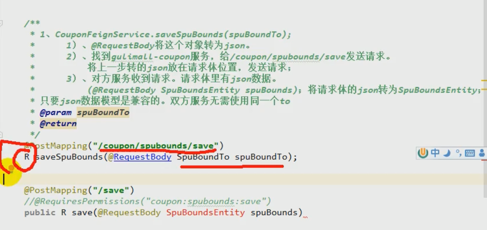

### 统一的异常处理

@RestControllerAdvice异常控制器,@ExceptionHandler异常捕获范围

```java
package com.pika.gstore.product.exception;

import com.pika.gstore.common.exception.BaseException;
import com.pika.gstore.common.utils.R;
import lombok.extern.slf4j.Slf4j;
import org.springframework.http.converter.HttpMessageNotReadableException;
import org.springframework.web.bind.MethodArgumentNotValidException;
import org.springframework.web.bind.annotation.ExceptionHandler;
import org.springframework.web.bind.annotation.RestControllerAdvice;

import java.util.HashMap;

/**
 * Desc:
 *
 * @author pikachu
 * @since 2022/11/27 21:41
 */
@RestControllerAdvice(basePackages = "com.pika.gstore.product.controller")
@Slf4j
public class ExceptionController {
    @ExceptionHandler(value = {MethodArgumentNotValidException.class})
    public R handle(MethodArgumentNotValidException e) {
        HashMap<String, String> map = new HashMap<>();
        e.getBindingResult().getFieldErrors().forEach(fieldError ->
                map.put(fieldError.getField(), fieldError.getDefaultMessage()
                ));
        log.error(e.getMessage());
        return R.error(BaseException.INVALID_DATA.getCode(), BaseException.INVALID_DATA.getMsg()).put("error", map);
    }


    @ExceptionHandler(value = HttpMessageNotReadableException.class)
    public R test1(HttpMessageNotReadableException e) {
        log.error(e.getMessage());
        return R.error(BaseException.CONVERT_ERROR.getCode(), BaseException.CONVERT_ERROR.getMsg());
    }

    @ExceptionHandler(value = Exception.class)
    public R test2(Exception e) {
        String name = e.getClass().getName();
        log.error(name);
        e.printStackTrace();
        return R.error(BaseException.UNKOWN_EXCEPTION.getCode(), e.getMessage());
    }
}

```

## Json

全局日期格式化

```yaml
spring:
  # jackson时间格式化
  jackson:
    time-zone: GMT+8
    date-format: yyyy-MM-dd HH:mm:ss
```

Json转Bean,使用hutool工具,info为Map类型数据,直接强转为SkuInfoVo会出错

错误转换:

```java
    @org.junit.jupiter.api.Test
public void test4(){
        String json="{skuId=1, spuId=1, skuName=Apple iPhone 14 Pro 暗紫色 8+128, skuDesc=null, catalogId=225, brandId=5, skuDefaultImg=https://gstore-piks.oss-cn-hangzhou.aliyuncs.com/2022/12/04/a90228bf-ba23-4dbb-8b20-b750f86d04d5_Snipaste_2022-12-04_19-21-57.png, skuTitle=Apple iPhone 14 Pro 暗紫色 8+128, skuSubtitle=支持移动联通电信5G 双卡双待手机, price=9429.0, saleCount=0}";
        SkuInfoVo skuInfoVo=JSONUtil.toBean(json,SkuInfoVo.class);
        System.out.println("skuInfoVo = "+skuInfoVo);
        }
```

```java
JSONUtil.parse(info).toBean(SkuInfoVo.class);
```

## 密码加密

1. 服务器:

可使用hutool或者springframework自带的工具方法,两者兼容,可互相密码匹配

> 存在漏洞:Vulnerable API usage CVE-2020-5408 Use of Insufficiently Random Values vulnerability pending CVSS allocation

```java
    @Test
public void test2(){
        //huTool
        // $2a$10$HGWZrtojpX4POBWrmQFL9OjJBxSVBDEqsy9Ue4DSc2hYaW8YvhJ1q
        // $2a$10$yQtLP1KTKGZ/.PrFyMqMy.jdGbjIYbdGp/4pamejZZNwothg35ir2
        // 加密
        String encode=BCrypt.hashpw("12345");
        //plaintext – 需要验证的明文密码 hashed – 密文
        boolean checkpw=BCrypt.checkpw("12345",encode);
        System.out.println("encode = "+encode);
        System.out.println("checkpw = "+checkpw);
        }
@Test
public void test3(){
        //org.springframework.security.crypto.bcrypt
        BCryptPasswordEncoder encoder=new BCryptPasswordEncoder();
        String encode=encoder.encode("12345");
        boolean matches=encoder.matches("12345",encode);
        System.out.println("encode = "+encode);
        System.out.println("matches = "+matches);
        }
```

2. 浏览器

# 数据库

## 本地事务

在@Transaction事务下读取未提交数据

```sql
SET SESSION TRANSACTION ISOLATION LEVEL READ UNCOMMITTED;
```

防止出现异常后事务回滚(手动处理异常):

```java
try{

        }catch(Exception e){

        }
```

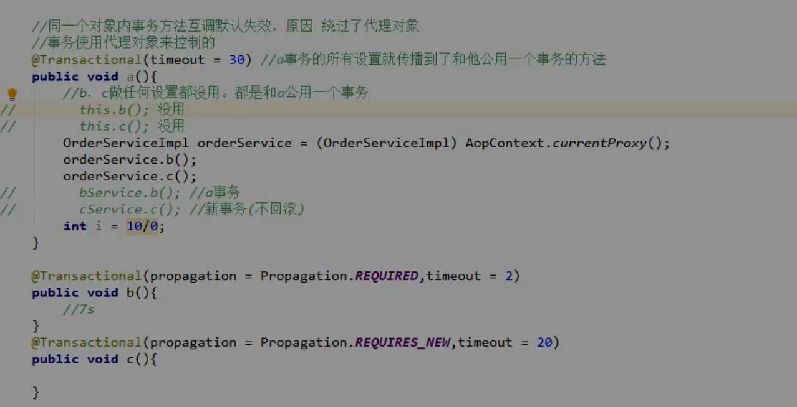

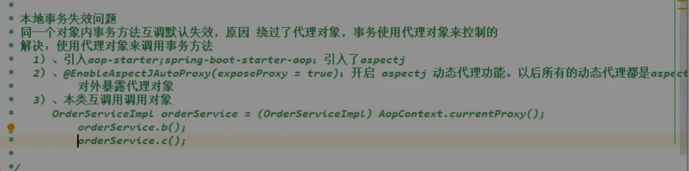

## 分布式事务

## mybatisPlus

### LambdaQueryWrapper实现set num = num+1

不存在记录则新增,存在则更新stock=stock+skuNum

```java
        WareSkuEntity wareSku=new WareSkuEntity();
        wareSku.setWareId(wareId);
        wareSku.setSkuId(skuId);
        wareSku.setStock(skuNum);
        LambdaUpdateWrapper<WareSkuEntity> wrapper=new LambdaUpdateWrapper<>();
        wrapper.setSql(skuNum>0,"stock=stock+"+skuNum)
        .eq(WareSkuEntity::getWareId,wareId)
        .eq(WareSkuEntity::getWareId,wareId);
        saveOrUpdate(wareSku,wrapper);
```

逻辑删除@TableLogic

```yaml
mybatis-plus:
  mapper-locations: classpath:/mapper/**/*.xml
  global-config:
    db-config:
      id-type: auto
      #      logic-delete-field: show_status # 全局逻辑删除的实体字段名(since 3.3.0,配置后可以忽略不配置步骤2)
      logic-delete-value: 0 # 逻辑已删除值(默认为 1)
      logic-not-delete-value: 1 # 逻辑未删除值(默认为 0)
```

### 返回结果处理

resultMap不支持封装内部类

# 缓存

## Redis缓存中间件的使用

### 基本步骤

1. 添加依赖

```xml

<dependency>
    <groupId>org.springframework.boot</groupId>
    <artifactId>spring-boot-starter-data-redis</artifactId>
</dependency>
```

1. 配置yaml

2. 使用逻辑

    1. 往redis存放的数据实时性,一致性要求不高

    2. 往redis存储的数据类型尽量跨平台兼容,如json

    3. 业务逻辑需要从数据库获取数据时先从redis中获取,

       若获取成功则json转换处理;

       获取失败则需要查询数据库,并将获取的数据转换为json存入redis

### 问题

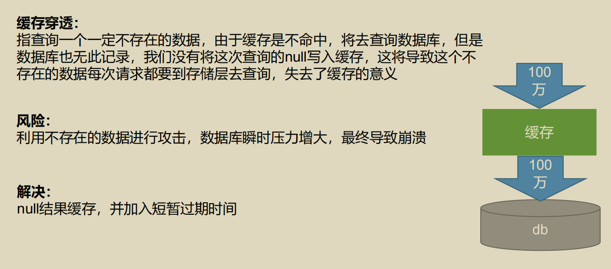

## Redisson分布式锁

依赖:

```xml
        <!--        redisson分布式锁,分布式对象  -->
<dependency>
    <groupId>org.redisson</groupId>
    <artifactId>redisson</artifactId>
    <version>3.19.0</version>
</dependency>
```

配置:

```java

@Configuration
@Data
public class RedissonConfig {
    @Value("${spring.redis.host}")
    private String host;
    @Value(("${spring.redis.port}"))
    private String port;

    @Bean
    public RedissonClient redissonClient() {
        Config config = new Config();
        config.useSingleServer().setAddress("redis://" + host + ":" + port);
        return Redisson.create(config);
    }
}
```

https://github.com/redisson/redisson/wiki/8.-%E5%88%86%E5%B8%83%E5%BC%8F%E9%94%81%E5%92%8C%E5%90%8C%E6%AD%A5%E5%99%A8

### 看门狗机制

大家都知道，如果负责储存这个分布式锁的Redis节点宕机以后，而且这个锁正好处于锁住的状态时，这个锁会出现锁死的状态。为了避免这种情况的发生，Redisson内部提供了一个监控锁的看门狗，它的作用是在Redisson实例被关闭前，不断的延长锁的有效期。默认情况下，看门狗的检查锁的超时时间是30秒钟，也可以通过修改[Config.lockWatchdogTimeout](https://github.com/redisson/redisson/wiki/2.-配置方法#lockwatchdogtimeout监控锁的看门狗超时单位毫秒)
来另行指定。

另外Redisson还通过加锁的方法提供了`leaseTime`的参数来指定加锁的时间。超过这个时间后锁便自动解开了。

```java
    @ResponseBody
@GetMapping(value = "/hello")
public String hello(){

        //1、获取一把锁，只要锁的名字一样，就是同一把锁
        RLock myLock=redisson.getLock("my-lock");

        //2、加锁
        myLock.lock();      //阻塞式等待。默认加的锁都是30s
        //1）、锁的自动续期，如果业务超长，运行期间自动锁上新的30s。不用担心业务时间长，锁自动过期被删掉
        //2）、加锁的业务只要运行完成，就不会给当前锁续期，即使不手动解锁，锁默认会在30s内自动过期，不会产生死锁问题
        // myLock.lock(10,TimeUnit.SECONDS);   //10秒钟自动解锁,自动解锁时间一定要大于业务执行时间
        //问题：在锁时间到了以后，不会自动续期
        //1、如果我们传递了锁的超时时间，就发送给redis执行脚本，进行占锁，默认超时就是 我们制定的时间
        //2、如果我们指定锁的超时时间，就使用 lockWatchdogTimeout = 30 * 1000 【看门狗默认时间】
        //只要占锁成功，就会启动一个定时任务【重新给锁设置过期时间，新的过期时间就是看门狗的默认时间】,每隔10秒都会自动的再次续期，续成30秒
        // internalLockLeaseTime 【看门狗时间】 / 3， 10s
        try{
        System.out.println("加锁成功，执行业务..."+Thread.currentThread().getId());
        try{TimeUnit.SECONDS.sleep(20);}catch(InterruptedException e){e.printStackTrace();}
        }catch(Exception ex){
        ex.printStackTrace();
        }finally{
        //3、解锁  假设解锁代码没有运行，Redisson会不会出现死锁
        System.out.println("释放锁..."+Thread.currentThread().getId());
        myLock.unlock();
        }

        return"hello";
        }
```

### 读写锁

基于Redis的Redisson分布式可重入读写锁[`RReadWriteLock`](http://static.javadoc.io/org.redisson/redisson/3.4.3/org/redisson/api/RReadWriteLock.html)
Java对象实现了`java.util.concurrent.locks.ReadWriteLock`
接口。其中读锁和写锁都继承了[RLock](https://github.com/redisson/redisson/wiki/8.-分布式锁和同步器#81-可重入锁reentrant-lock)
接口。

分布式可重入读写锁允许同时有多个读锁和一个写锁处于加锁状态。

```java
    /**
 * 保证一定能读到最新数据，修改期间，写锁是一个排它锁（互斥锁、独享锁），读锁是一个共享锁
 * 写锁没释放读锁必须等待
 * 读 + 读 ：相当于无锁，并发读，只会在Redis中记录好，所有当前的读锁。他们都会同时加锁成功
 * 写 + 读 ：必须等待写锁释放
 * 写 + 写 ：阻塞方式
 * 读 + 写 ：有读锁。写也需要等待
 * 只要有读或者写的存都必须等待
 * @return
 */
@GetMapping(value = "/write")
@ResponseBody
public String writeValue(){
        String s="";
        RReadWriteLock readWriteLock=redisson.getReadWriteLock("rw-lock");
        RLock rLock=readWriteLock.writeLock();
        try{
        //1、改数据加写锁，读数据加读锁
        rLock.lock();
        s=UUID.randomUUID().toString();
        ValueOperations<String, String> ops=stringRedisTemplate.opsForValue();
        ops.set("writeValue",s);
        TimeUnit.SECONDS.sleep(10);
        }catch(InterruptedException e){
        e.printStackTrace();
        }finally{
        rLock.unlock();
        }

        return s;
        }

@GetMapping(value = "/read")
@ResponseBody
public String readValue(){
        String s="";
        RReadWriteLock readWriteLock=redisson.getReadWriteLock("rw-lock");
        //加读锁
        RLock rLock=readWriteLock.readLock();
        try{
        rLock.lock();
        ValueOperations<String, String> ops=stringRedisTemplate.opsForValue();
        s=ops.get("writeValue");
        try{TimeUnit.SECONDS.sleep(10);}catch(InterruptedException e){e.printStackTrace();}
        }catch(Exception e){
        e.printStackTrace();
        }finally{
        rLock.unlock();
        }

        return s;
        }
```

### 信号量

`RLock`对象完全符合Java的Lock规范。也就是说只有拥有锁的进程才能解锁，其他进程解锁则会抛出`IllegalMonitorStateException`
错误。但是如果遇到需要其他进程也能解锁的情况，请使用[分布式信号量`Semaphore`](https://github.com/redisson/redisson/wiki/8.-分布式锁和同步器#86-信号量semaphore)
对象.

基于Redis的Redisson的分布式信号量（[Semaphore](http://static.javadoc.io/org.redisson/redisson/3.10.0/org/redisson/api/RSemaphore.html)
）Java对象`RSemaphore`采用了与`java.util.concurrent.Semaphore`
相似的接口和用法。同时还提供了[异步（Async）](http://static.javadoc.io/org.redisson/redisson/3.10.0/org/redisson/api/RSemaphoreAsync.html)、[反射式（Reactive）](http://static.javadoc.io/org.redisson/redisson/3.10.0/org/redisson/api/RSemaphoreReactive.html)
和[RxJava2标准](http://static.javadoc.io/org.redisson/redisson/3.10.0/org/redisson/api/RSemaphoreRx.html)的接口。

```java
    /**
 * 车库停车
 * 3车位
 * 信号量也可以做分布式限流
 */
@GetMapping(value = "/park")
@ResponseBody
public String park()throws InterruptedException{

        RSemaphore park=redisson.getSemaphore("park");
        park.acquire();     //获取一个信号、获取一个值,占一个车位
        boolean flag=park.tryAcquire();

        if(flag){
        //执行业务
        }else{
        return"error";
        }

        return"ok=>"+flag;
        }

@GetMapping(value = "/go")
@ResponseBody
public String go(){
        RSemaphore park=redisson.getSemaphore("park");
        park.release();     //释放一个车位
        return"ok";
        }
```

## SpringCache

| Spring                         | JSR-107           | Remark                                                                                             |
|:-------------------------------|:------------------|:---------------------------------------------------------------------------------------------------|
| `@Cacheable`                   | `@CacheResult`    | 非常相似。@ CacheResult 可以缓存特定的异常，并强制执行方法，而不管缓存的内容如何。                                                   |
| `@CachePut`                    | `@CachePut`       | 当 Spring 使用方法调用的结果更新缓存时，JCache 要求将它作为一个参数传递，该参数用@CacheValue 进行注释。由于这种差异，JCache 允许在实际方法调用之前或之后更新缓存。 |
| `@CacheEvict`                  | `@CacheRemove`    | 非常相似。当方法调用导致异常时,@CacheRemove 支持条件驱逐。                                                               |
| `@CacheEvict(allEntries=true)` | `@CacheRemoveAll` | See `@CacheRemove`.                                                                                |
| `@CacheConfig`                 | `@CacheDefaults`  | 允许您以类似的方式配置相同的概念。                                                                                  |

### 使用步骤

1. 配置依赖

```xml

<dependency>
    <groupId>org.springframework.boot</groupId>
    <artifactId>spring-boot-starter-cache</artifactId>
</dependency>
```

```yaml
spring:
  #缓存
  cache:
    type: redis
    redis:
      #过期时间 ms
      time-to-live: 3600000 #60*60*1000=1h
      cache-null-values: true #是否缓存空值
      key-prefix: 'cache::product::'  #use-key-prefix=true时作为键前缀,此项为配置时使用缓存名作为前缀
      use-key-prefix: true  #是否使用指定前缀
```

2. 编写配置类(其它类型缓存同理)

```java

@EnableCaching
@Configuration
@EnableConfigurationProperties(CacheProperties.class)
public class MyRedisCacheConfiguration {
    @Bean
    public RedisCacheConfiguration redisCacheConfiguration(CacheProperties cacheProperties) {
        CacheProperties.Redis redisProperties = cacheProperties.getRedis();
        RedisCacheConfiguration config = RedisCacheConfiguration.defaultCacheConfig();
        //使用json序列化
        config = config.serializeValuesWith(RedisSerializationContext.SerializationPair.fromSerializer(RedisSerializer.json()));
        if (redisProperties.getTimeToLive() != null) {
            config = config.entryTtl(redisProperties.getTimeToLive());
        }
        if (redisProperties.getKeyPrefix() != null) {
            config = config.prefixKeysWith(redisProperties.getKeyPrefix());
        }
        if (!redisProperties.isCacheNullValues()) {
            config = config.disableCachingNullValues();
        }
        if (!redisProperties.isUseKeyPrefix()) {
            config = config.disableKeyPrefix();
        }
        return config;
    }
}
```

2. 添加注解

#### @Cacheable

@Cacheable(cacheNames = {"categoryFirstLever"}, key = "#root.methodName" )中key未普通字符串时需要添加单引号,

如@Cacheable(cacheNames = {"categoryFirstLever"}, key = "‘getFirstLevel’” )

```java
    @Cacheable(cacheNames = {"categoryFirstLever"}, key = "#root.methodName")
public List<CategoryEntity> getFirstLevel(){
        ...
        }
```

2. 测试结果

use-key-prefix: true,设置key-prefix

use-key-prefix=false

use-key-prefix: true,未设置key-prefix

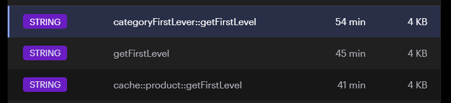

#### @CacheEvict失效模式

删除缓存

```java
    @Override
@CacheEvict(cacheNames = "category", key = "'getFirstLevel'")
public void updateCascade(CategoryEntity category){
        ...
        }
```

删除缓存分区的所有数据:

```java
@CacheEvict(cacheNames = "category", allEntries = true)
public void updateCascade(CategoryEntity category){
        // 更新本表数据
        updateById(category);
        // 更新 CategoryBrandRelation 表数据
        LambdaUpdateWrapper<CategoryBrandRelationEntity> wrapper=new LambdaUpdateWrapper<>();
        wrapper.set(CategoryBrandRelationEntity::getCatelogName,category.getName())
        .eq(CategoryBrandRelationEntity::getCatelogId,category.getCatId());
        categoryBrandRelationService.update(wrapper);

        // TODO: 2022/11/28 更新其它冗余表数据
        }
```

#### @Caching

批量操作:批量删除缓存

```java
    @Caching(evict = {
        @CacheEvict(cacheNames = "category", key = "'getFirstLevel'"),
        @CacheEvict(cacheNames = "category", key = "'getCatalogJson'"),
})
public void updateCascade(CategoryEntity category){
        ...
        }
```

#### @CachePut双写模式

将修改后的结果写入缓存

### 约定

1. 同一类型的数据使用相同缓存分区,利于批量删除

### Spring-Cache的不足之处：

1）、读模式
缓存穿透：查询一个null数据。解决方案：缓存空数据
缓存击穿：大量并发进来同时查询一个正好过期的数据。解决方案：加锁 ? 默认是无加锁的;使用sync = true来解决击穿问题
缓存雪崩：大量的key同时过期。解决：加随机时间。加上过期时间
2)、写模式：（缓存与数据库一致）
1）、读写加锁。
2）、引入Canal,感知到MySQL的更新去更新Redis
3）、读多写多，直接去数据库查询就行

总结：
常规数据（读多写少，即时性，一致性要求不高的数据，完全可以使用Spring-Cache）：写模式(只要缓存的数据有过期时间就足够了)
特殊数据：特殊设计

原理：
CacheManager(RedisCacheManager)->Cache(RedisCache)->Cache负责缓存的读写

# Idea

## 批量启动服务

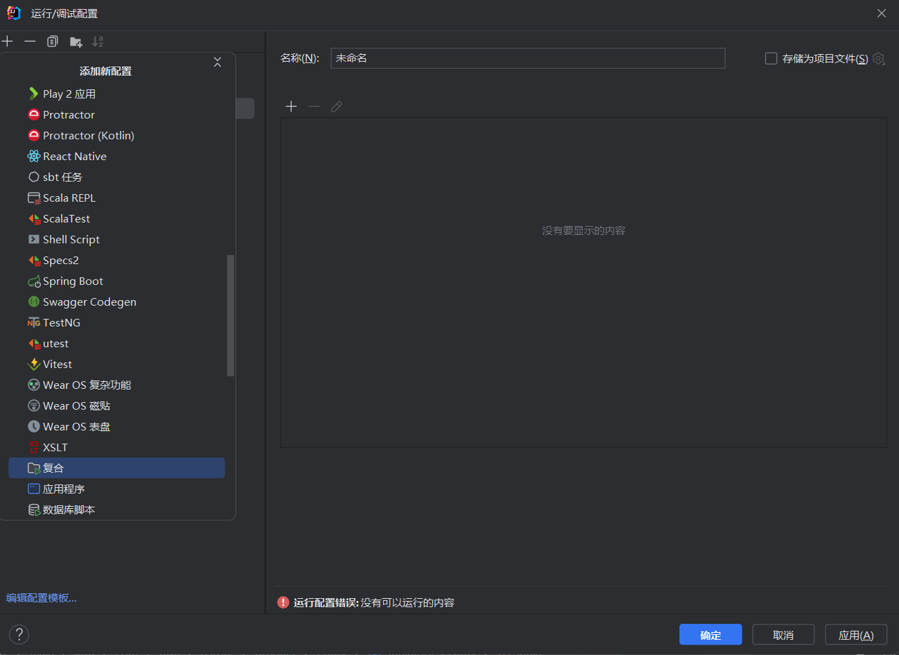

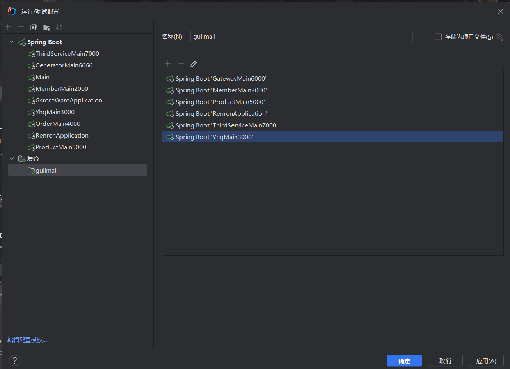

## 限制内存

```shell
-Xmx100m
```

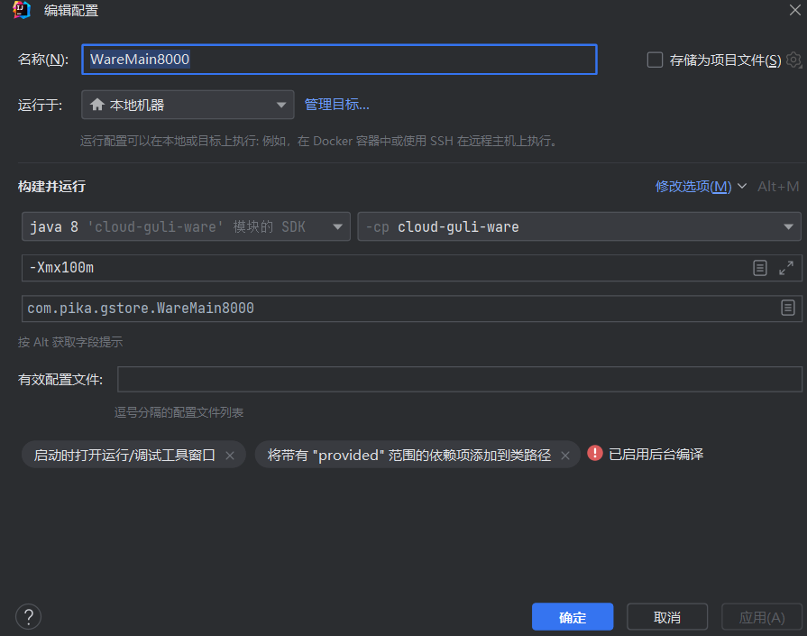

## 代码调试

条件筛选启用断点:    当beanName包含“AServiceImpl”时断点才生效

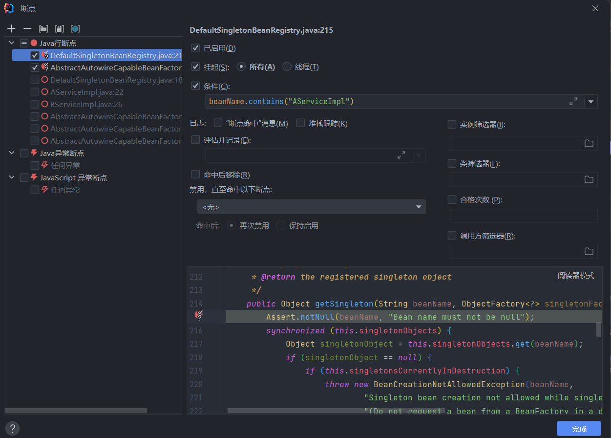

# Java 流式操作

## 1. 什么是 Stream

`Stream`是数据渠道，用于操作数据源所生成的元素序列，它可以实现对集合（`Collection`）的复杂操作，例如查找、替换、过滤和映射数据等操作。

我们这里说的`Stream`不同于`java`的输入输出流。另外，Collection 是一种静态的**数据结构**，存储在内存中，而`Stream`
是用于计算的，通过`CPU`实现计算。注意不要混淆。

- 惰性求值：如果没有终结操作，流的中间操作是不会执行的
- 流是一次性的：一个流对象经过一个终结操作后，这个流就不能再使用了
- 不会影响原数据：正常情况下流的操作不会影响原数据

> **Tips**：`Stream`自己不会存储数据；`Stream`不会改变源对象，而是返回一个新的持有结果的`Stream`（不可变性）；`Stream`
> 操作是延迟执行的（这一点将在后面介绍）。

以下代码:

```java
    public Long[]getNewUserByMonth(String month){
        Long[]result=new Long[30];
        List<MonthNewUserDto> newUserDtos=baseMapper.getNewUserByMonth(month);
        newUserDtos.forEach(System.out::println);
        newUserDtos.stream().map(item->
        result[Integer.parseInt(item.getDaystr().substring(item.getDaystr().length()-2))]=item.getCounts());
        System.out.println("result = "+Arrays.toString(result));
        return result;
        }
```

输出:

```java
MonthNewUserDto(daystr=2022-12-01,counts=47)
        MonthNewUserDto(daystr=2022-12-02,counts=46)
        MonthNewUserDto(daystr=2022-12-03,counts=25)
        MonthNewUserDto(daystr=2022-12-04,counts=47)
        MonthNewUserDto(daystr=2022-12-05,counts=29)
        MonthNewUserDto(daystr=2022-12-06,counts=38)
        MonthNewUserDto(daystr=2022-12-07,counts=37)
        MonthNewUserDto(daystr=2022-12-08,counts=25)
        MonthNewUserDto(daystr=2022-12-09,counts=24)
        result=[null,null,null,null,null,null,null,null,null,null,null,null,null,null,null,null,null,null,null,null,null,null,null,null,null,null,null,null,null,null]
```

可以发现result并没有被更新,只要流没有终止操作,那么流中间的步骤都不会执行

## 2. 为什么使用 Stream API

我们在实际开发中，项目中的很多数据都来源于关系型数据库（例如 MySQL、Oracle 数据库），我们使用`SQL`的条件语句就可以实现对数据的筛选、过滤等等操作；

但也有很多数据来源于非关系型数据库（`Redis`、`MongoDB`等），想要处理这些数据，往往需要在 Java 层面去处理。

使用`Stream API`对集合中的数据进行操作，就类似于 SQL 执行的数据库查询。也可以使用`Stream API`
来执行并行操作。简单来说，`Stream API`提供了一种高效且易于使用的处理数据的方式。

## 3. 流式操作的执行流程

流式操作通常分为以下 3 个步骤：

1. **创建`Stream`对象**：通过一个数据源（例如集合、数组），获取一个流；
2. **中间操作**：一个中间的链式操作，对数据源的数据进行处理（例如过滤、排序等），直到执行终止操作才执行；
3. **终止操作**：一旦执行终止操作，就执行中间的链式操作，并产生结果。

下图展示了`Stream`的执行流程：

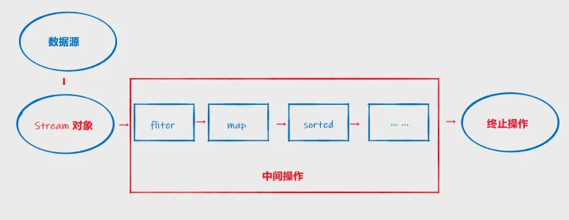

接下来我们就按照这 3 个步骤的顺序来展开学习`Stream API`。

## 4. Stream 对象的创建

有 4 种方式来创建`Stream`对象。

### 4.1 通过集合创建 Stream

Java 8 的`java.util.Collection` 接口被扩展，提供了两个获取流的默认方法：

- `default Stream<E> stream()`：返回一个串行流（顺序流）；
- `default Stream<E> parallelStream()`：返回一个并行流。

实例如下：

```java
// 创建一个集合，并添加几个元素
List<String> stringList=new ArrayList<>();
        stringList.add("hello");
        stringList.add("world");
        stringList.add("java");

// 通过集合获取串行 stream 对象
        Stream<String> stream=stringList.stream();
// 通过集合获取并行 stream 对象
        Stream<String> personStream=stringList.parallelStream();
```

串行流并行流的区别是：串行流从集合中取数据是按照集合的顺序的；而并行流是并行操作的，获取到的数据是无序的。

### 4.2 通过数组创建 Stream

Java 8 中的`java.util.Arrays`的静态方法`stream()`可以获取数组流：

- `static <T> Stream<T> stream(T[] array)`：返回一个数组流。

此外，`stream()`还有几个重载方法，能够处理对应的基本数据类型的数组：

- `public static IntStream stream(int[] array)`：返回以指定数组作为其源的连续`IntStream`；
- `public static LongStream stream(long[] array)`：返回以指定数组作为其源的连续`LongStream`；
- `public static DoubleStream stream(double[] array)`：返回以指定数组作为其源的连续`DoubleStream`。

实例如下：

```java
import java.util.Arrays;
import java.util.stream.IntStream;
import java.util.stream.Stream;

public class StreamDemo1 {

    public static void main(String[] args) {
        // 初始化一个整型数组
        int[] arr = new int[]{1, 2, 3};
        // 通过整型数组，获取整形的 stream 对象
        IntStream stream1 = Arrays.stream(arr);

        // 通过字符串类型的数组，获取泛型类型为 String 的 stream 对象
        String[] stringArr = new String[]{"Hello", "imooc"};
        Stream<String> stream2 = Arrays.stream(stringArr);
    }
}
```

### 4.3 通过 Stream 的 `of()`方法

可以通过`Stream`类下的`of()`方法来创建 Stream 对象，实例如下：

```java
import java.util.stream.Stream;

public class StreamDemo1 {

    public static void main(String[] args) {
        // 通过 Stream 类下的 of() 方法，创建 stream 对象、
        Stream<Integer> stream = Stream.of(1, 2, 3);
    }
}
```

### 4.4 创建无限流

可以使用`Stream`类下的静态方法`iterate()`以及`generate()`创建无限流：

- `public static<T> Stream<T> iterate(final T seed, final UnaryOperator<T> f)`：遍历；
- `public static<T> Stream<T> generate(Supplier<T> s)`：生成。

创建无限流的这种方式实际使用较少，大家了解一下即可。

## 5. Stream 的中间操作

多个中间操作可以连接起来形成一个流水线，除非流水线上触发终止操作，否则中间操作不会执行任何的处理。在终止操作时会一次性全部处理这些中间操作，称为“惰性求值”。下面，我们来学习一下常用的中间操作方法。

### 5.1 筛选与切片

关于筛选和切片中间操作，有下面几个常用方法：

- `filter(Predicate p)`：接收 `Lambda`，从流中清除某些元素；
- `distinct()`：筛选，通过流生成元素的`hashCode`和`equals()`方法去除重复元素；
- `limit(long maxSize)`：截断流，使其元素不超过给定数量；
- `skip(long n)`：跳过元素，返回一个扔掉了前 `n` 个元素的流。若流中元素不足 `n` 个，则返回一个空流。与`limit(n)`互补。

我们先来看一个过滤集合元素的实例：

```java
import java.util.ArrayList;
import java.util.List;
import java.util.stream.Stream;

public class StreamDemo2 {

    static class Person {
        private String name;
        private int age;

        public Person() {
        }

        public Person(String name, int age) {
            this.name = name;
            this.age = age;
        }

        public String getName() {
            return name;
        }

        public void setName(String name) {
            this.name = name;
        }

        public int getAge() {
            return age;
        }

        public void setAge(int age) {
            this.age = age;
        }

        @Override
        public String toString() {
            return "Person{" +
                    "name='" + name + '\'' +
                    ", age=" + age +
                    '}';
        }
    }

    /**
     * 创建一个 Person 的集合
     * @return List
     */
    public static List<Person> createPeople() {
        ArrayList<Person> people = new ArrayList<>();
        Person person1 = new Person("小明", 15);
        Person person2 = new Person("小芳", 20);
        Person person3 = new Person("小李", 18);
        Person person4 = new Person("小付", 23);
        Person person5 = new Person("大飞", 22);
        people.add(person1);
        people.add(person2);
        people.add(person3);
        people.add(person4);
        people.add(person5);
        return people;
    }

    public static void main(String[] args) {
        List<Person> people = createPeople();
        // 创建 Stream 对象
        Stream<Person> stream = people.stream();
        // 过滤年龄大于 20 的 person
        Stream<Person> personStream = stream.filter(person -> person.getAge() >= 20);
        // 触发终止操作才能执行中间操作，遍历列表中元素并打印
        personStream.forEach(System.out::println);
    }
}
```

运行结果：

```java
Person{name='小芳',age=20}
        Person{name='小付',age=23}
        Person{name='大飞',age=22}
```

实例中，有一个静态内部类`Person`以及一个创建`Person`的集合的静态方法`createPeople()`
，在主方法中，我们先调用该静态方法获取到一个`Person`列表，然后创建了`Stream`对象，再执行中间操作（即调用`fliter()`
方法），这个方法的参数类型是一个**断言型的函数式接口**，接口下的抽象方法`test()`要求返回`boolean`结果，因此我们使用`Lambda`
表达式，`Lambda`体为`person.getAge() >= 20`，其返回值就是一个布尔型结果，这样就实现了对年龄大于等于 20 的`person`对象的过滤。

由于必须触发终止操作才能执行中间操作，我们又调用了`forEach(System.out::println)`
，在这里记住它作用是遍历该列表并打印每一个元素即可，我们下面将会讲解。另外，`filter()`等这些由于中间操作返回类型为
Stream，所以支持链式操作，我们可以将主方法中最后两行代码合并成一行：

```java
stream.filter(person->person.getAge()>=20).forEach(System.out::println);
```

我们再来看一个截断流的使用实例：

```java
import java.util.ArrayList;
import java.util.List;
import java.util.stream.Stream;

public class StreamDemo3 {

    static class Person {
        private String name;
        private int age;

        public Person() {
        }

        public Person(String name, int age) {
            this.name = name;
            this.age = age;
        }

        public String getName() {
            return name;
        }

        public void setName(String name) {
            this.name = name;
        }

        public int getAge() {
            return age;
        }

        public void setAge(int age) {
            this.age = age;
        }

        @Override
        public String toString() {
            return "Person{" +
                    "name='" + name + '\'' +
                    ", age=" + age +
                    '}';
        }
    }

    /**
     * 创建一个 Person 的集合
     * @return List
     */
    public static List<Person> createPeople() {
        ArrayList<Person> people = new ArrayList<>();
        Person person1 = new Person("小明", 15);
        Person person2 = new Person("小芳", 20);
        Person person3 = new Person("小李", 18);
        Person person4 = new Person("小付", 23);
        Person person5 = new Person("大飞", 22);
        people.add(person1);
        people.add(person2);
        people.add(person3);
        people.add(person4);
        people.add(person5);
        return people;
    }

    public static void main(String[] args) {
        List<Person> people = createPeople();
        // 创建 Stream 对象
        Stream<Person> stream = people.stream();
        // 截断流，并调用终止操作打印集合中元素
        stream.limit(2).forEach(System.out::println);
    }
}
```

运行结果：

```java
Person{name='小明',age=15}
        Person{name='小芳',age=20}
```

根据运行结果显示，我们只打印了集合中的前两条数据。

跳过前 2 条数据的代码实例如下：

```java
// 非完整代码
public static void main(String[]args){
        List<Person> people=createPeople();
        // 创建 Stream 对象
        Stream<Person> stream=people.stream();
        // 跳过前两个元素，并调用终止操作打印集合中元素
        stream.skip(2).forEach(System.out::println);
        }
```

运行结果：

```java
Person{name='小李',age=18}
        Person{name='小付',age=23}
        Person{name='大飞',age=22}
```

`distinct()`方法会根据`equals()`和`hashCode()`方法筛选重复数据，我们在`Person`类内部重写这两个方法，并且在`createPerson()`
方法中，添加几个重复的数据 ，实例如下：

```java
import java.util.ArrayList;
import java.util.List;
import java.util.Objects;
import java.util.stream.Stream;

public class StreamDemo4 {

    static class Person {
        private String name;
        private int age;

        public Person() {
        }

        public Person(String name, int age) {
            this.name = name;
            this.age = age;
        }

        public String getName() {
            return name;
        }

        public void setName(String name) {
            this.name = name;
        }

        public int getAge() {
            return age;
        }

        public void setAge(int age) {
            this.age = age;
        }

        @Override
        public String toString() {
            return "Person{" +
                    "name='" + name + '\'' +
                    ", age=" + age +
                    '}';
        }

        @Override
        public boolean equals(Object o) {
            if (this == o) return true;
            if (o == null || getClass() != o.getClass()) return false;
            Person person = (Person) o;
            return age == person.age &&
                    Objects.equals(name, person.name);
        }

        @Override
        public int hashCode() {
            return Objects.hash(name, age);
        }
    }

    /**
     * 创建一个 Person 的集合
     * @return List
     */
    public static List<Person> createPeople() {
        ArrayList<Person> people = new ArrayList<>();
        people.add(new Person("小明", 15));
        people.add(new Person("小芳", 20));
        people.add(new Person("小李", 18));
        people.add(new Person("小付", 23));
        people.add(new Person("大飞", 22));
        return people;
    }

    public static void main(String[] args) {
        List<Person> people = createPeople();
        // 创建 Stream 对象
        Stream<Person> stream = people.stream();

        System.out.println("去重前，集合中元素有：");
        stream.forEach(System.out::println);

        System.out.println("去重后，集合中元素有：");
        // 创建一个新流
        Stream<Person> stream1 = people.stream();
        // 截断流，并调用终止操作打印集合中元素
        stream1.distinct().forEach(System.out::println);
    }
}
```

运行结果：

```java
去重前，集合中元素有：
        Person{name='小明',age=15}
        Person{name='小芳',age=20}
        Person{name='小李',age=18}
        Person{name='小付',age=23}
        Person{name='大飞',age=22}
        去重后，集合中元素有：
        Person{name='小明',age=15}
        Person{name='小芳',age=20}
        Person{name='小李',age=18}
        Person{name='小付',age=23}
        Person{name='大飞',age=22}
```

### 5.2 映射

关于映射中间操作，有下面几个常用方法：

- `map(Function f)`：接收一个方法作为参数，该方法会被应用到每个元素上，并将其映射成一个新的元素；
- `mapToDouble(ToDoubleFunction f)`：接收一个方法作为参数，该方法会被应用到每个元素上，产生一个新的`DoubleStream`；
- `mapToLong(ToLongFunction f)`：接收一个方法作为参数，该方法会被应用到每个元素上，产生一个新的`LongStream`；
- `flatMap(Function f)`：接收一个方法作为参数，将流中的每个值都换成另一个流，然后把所有流连接成一个流。

请查看如下实例：

```java
import java.util.Arrays;
import java.util.List;

public class StreamDemo5 {

    public static void main(String[] args) {
        // 创建一个包含小写字母元素的字符串列表
        List<String> stringList = Arrays.asList("php", "js", "python", "java");
        // 调用 map() 方法，将 String 下的 toUpperCase() 方法作为参数，这个方法会被应用到每个元素上，映射成一个新元素，最后打印映射后的元素
        stringList.stream().map(String::toUpperCase).forEach(System.out::println);
    }

}
```

运行结果：

```java
PHP
        JS
        PYTHON
        JAVA
```

可参考下图，理解映射的过程：

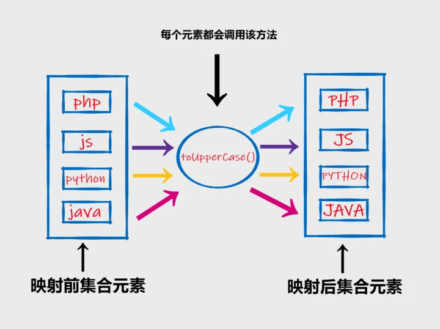

### 5.3 排序

关于排序中间操作，有下面几个常用方法：

- `sorted()`：产生一个新流，其中按照自然顺序排序；
- `sorted(Comparator com)`：产生一个新流，其中按照比较器顺序排序。

请查看如下实例：

```java
import java.util.Arrays;
import java.util.List;

public class StreamDemo6 {

    public static void main(String[] args) {
        List<Integer> integers = Arrays.asList(10, 12, 9, 8, 20, 1);
        // 调用 sorted() 方法自然排序，并打印每个元素
        integers.stream().sorted().forEach(System.out::println);
    }

}
```

运行结果：

```java
1
        8
        9
        10
        12
        20
```

上面实例中，我们调用`sorted()`
方法对集合元素进行了从小到大的自然排序，那么如果想要实现从大到小排序，任何实现呢？此时就要用到`sorted(Comparator com)`
方法定制排序，查看如下实例：

```java
import java.util.Arrays;
import java.util.List;

public class StreamDemo6 {

    public static void main(String[] args) {
        List<Integer> integers = Arrays.asList(10, 12, 9, 8, 20, 1);
        // 定制排序
        integers.stream().sorted(
                (i1, i2) -> -Integer.compare(i1, i2)
        ).forEach(System.out::println);
    }

}
```

运行结果：

```java
20
        12
        10
        9
        8
        1
```

实例中，`sorted()`方法接收的参数是一个函数式接口`Comparator`，因此使用`Lambda`表达式创建函数式接口实例即可，`Lambda`
体调用整型的比较方法，对返回的整型值做一个取反即可。

## 6. Stream 的终止操作

执行终止操作会从流的**流水线**上生成结果，其结果可以是任何不是流的值，例如`List`、`String`、`void`。

在上面实例中，我们一直在使用`forEach()`方法来执行流的终止操作，下面我们看看还有哪些其他终止操作。

### 6.1 匹配与查找

关于匹配与查找的终止操作，有下面几个常用方法：

- `allMatch(Predicate p)`：检查是否匹配所有元素；
- `anyMatch(Predicate p)`：检查是否至少匹配一个元素；
- `noneMatch(Predicate p)`：检查是否没有匹配所有元素；
- `findFirst()`：返回第一个元素；
- `findAny()`：返回当前流中的任意元素；
- `count()`：返回流中元素总数；
- `max(Comparator c)`：返回流中最大值；
- `min(Comparator c)`：返回流中最小值；
- `forEach(Consumer c)`：内部迭代（使用 Collection 接口需要用户去做迭代，称为外部迭代；相反 `Stream API`使用内部迭代）。

如下实例，演示了几个匹配元素相关方法的使用：

```java
import java.util.Arrays;
import java.util.List;

public class StreamDemo7 {

    public static void main(String[] args) {
        // 创建一个整型列表
        List<Integer> integers = Arrays.asList(10, 12, 9, 8, 20, 1);
        // 使用 allMatch(Predicate p) 检查是否匹配所有元素，如果匹配，则返回 true；否则返回 false
        boolean b1 = integers.stream().allMatch(integer -> integer > 0);
        if (b1) {
            System.out.println(integers + "列表中所有的元素都大于 0");
        } else {
            System.out.println(integers + "列表中不是所有的元素都大于 0");
        }

        // 使用 anyMatch(Predicate p) 检查是否至少匹配一个元素
        boolean b2 = integers.stream().anyMatch(integer -> integer >= 20);
        if (b2) {
            System.out.println(integers + "列表中至少存在一个的元素都大于等于 20");
        } else {
            System.out.println(integers + "列表中不存在任何一个大于等于 20 的元素");
        }

        // 使用 noneMath(Predicate p) 检查是否没有匹配所有元素
        boolean b3 = integers.stream().noneMatch(integer -> integer > 100);
        if (b3) {
            System.out.println(integers + "列表中不存在大于 100 的元素");
        } else {
            System.out.println(integers + "列表中存在大于 100 的元素");
        }
    }

}
```

运行结果：

```java
[10,12,9,8,20,1]列表中所有的元素都大于 0
        [10,12,9,8,20,1]列表中至少存在一个的元素都大于等于 20
        [10,12,9,8,20,1]列表中不存在大于 100的元素
```

查找元素的相关方法使用实例如下：

```java
import java.util.Arrays;
import java.util.List;
import java.util.Optional;

public class StreamDemo8 {

    public static void main(String[] args) {
        // 创建一个整型列表
        List<Integer> integers = Arrays.asList(10, 12, 9, 8, 20, 1);

        // 使用 findFirst() 获取当前流中的第一个元素
        Optional<Integer> first = integers.stream().findFirst();
        System.out.println(integers + "列表中第一个元素为：" + first);

        // 使用 findAny() 获取当前流中的任意元素
        Optional<Integer> any = integers.stream().findAny();
        System.out.println("列表中任意元素：" + any);

        // 使用 count() 获取当前流中元素总数
        long count = integers.stream().count();
        System.out.println(integers + "列表中元素总数为" + count);

        // 使用 max(Comparator c) 获取流中最大值
        Optional<Integer> max = integers.stream().max(Integer::compare);
        System.out.println(integers + "列表中最大值为" + max);

        // 使用 min(Comparator c) 获取流中最小值
        Optional<Integer> min = integers.stream().min(Integer::compare);
        System.out.println(integers + "列表中最小值为" + min);
    }

}
```

运行结果：

```java
[10,12,9,8,20,1]列表中第一个元素为：Optional[10]
        列表中任意元素：Optional[10]
        [10,12,9,8,20,1]列表中元素总数为 6
        [10,12,9,8,20,1]列表中最大值为 Optional[20]
        [10,12,9,8,20,1]列表中最小值为 Optional[1]
```

实例中，我们观察到`findFirst()`、`findAny()`、`max()`等方法的返回值类型为`Optional`类型，关于这个`Optional`类，我们将在下一小节具体介绍。

### 6.2 归约

关于归约的终止操作，有下面几个常用方法：

- `reduce(T identity, BinaryOperator b)`：可以将流中的元素反复结合起来，得到一个值。返回 T；
- `reduce(BinaryOperator b)`：可以将流中的元素反复结合起来，得到一个值，返回 `Optional<T>`。

归约相关方法的使用实例如下：

```java
import java.util.Arrays;
import java.util.List;
import java.util.Optional;

public class StreamDemo9 {

    public static void main(String[] args) {
        // 创建一个整型列表
        List<Integer> integers = Arrays.asList(10, 12, 9, 8, 20, 1);

        // 使用 reduce(T identity, BinaryOperator b) 计算列表中所有整数和
        Integer sum = integers.stream().reduce(0, Integer::sum);
        System.out.println(sum);

        // 使用 reduce(BinaryOperator b) 计算列表中所有整数和，返回一个 Optional<T>
        Optional<Integer> reduce = integers.stream().reduce(Integer::sum);
        System.out.println(reduce);
    }

}
```

运行结果：

```java
60
        Optional[60]
```

### 6.3 收集

`collect(Collector c)`：将流转换为其他形式。接收一个`Collector`接口的实现，用于给`Stream`中元素做汇总的方法。

实例如下：

```java
import java.util.Arrays;
import java.util.List;
import java.util.Set;
import java.util.stream.Collectors;

public class StreamDemo10 {

    public static void main(String[] args) {
        // 创建一个整型列表
        List<Integer> integers = Arrays.asList(10, 12, 9, 8, 20, 1, 10);
        Set<Integer> collect = integers.stream().collect(Collectors.toSet());
        System.out.println(collect);
    }

}
```

运行结果：

```java
[1,20,8,9,10,12]
```

Collector 接口中的实现决定了如何对流执行收集的操作（如收集到 List、Set、Map）。`java.util.stream.Collectors`
类提供了很多静态方法，可以方便地创建常用收集器实例，常用静态方法如下：

- `static List<T> toList()`：把流中元素收集到`List`；
- `static Set<T> toSet()`：把流中元素收集到`Set`；
- `static Collection<T> toCollection()`：把流中元素收集到创建的集合。

## 7. 小结

通过本小节的学习，我们知道了`Stream`不同于`java.io`下的输入输出流，它主要用于处理数据。`Stream API`
可用于处理非关系型数据库中的数据；想要使用流式操作，就要知道创建`Stream`对象的几种方式；流式操作可分为创建`Stream`
对象、中间操作和终止操作三个步骤。多个中间操作可以连接起来形成一个流水线，除非流水线上触发终止操作，否则中间操作不会执行任何的处理。执行终止操作会从流的
**流水线**上生成结果，其结果可以是任何不是流的值。

# Gateway

## 跨域

```java

@Configuration
public class MyCorsConfiguration {
    @Bean
    public CorsWebFilter corsWebFilter() {
        UrlBasedCorsConfigurationSource configSource = new UrlBasedCorsConfigurationSource();
        CorsConfiguration config = new CorsConfiguration();
        config.addAllowedOrigin("*");
        config.setAllowCredentials(true);
        config.addAllowedHeader("*");
        config.addAllowedMethod("*");
        configSource.registerCorsConfiguration("/**", config);

        return new CorsWebFilter(configSource);
    }
}

```

# 防止硬编码

## 枚举的使用

```java
package com.pika.gstore.common.constant;

import lombok.Getter;

/**
 * Desc:
 *
 * @author pikachu
 * @since 2022/12/5 0:14
 */
public class WareConstant {
    @Getter
    public enum PurchaseEnum {
        /**
         * 基本属性
         */
        CREATED(0, "新建"),
        ASSIGNED(1, "已分配"),
        GOT(2, "已领取"),
        FINISHED(3, "已完成"),
        ERROR(4, "有异常"),
        ;
        private final int code;
        private final String desc;

        PurchaseEnum(int code, String desc) {
            this.code = code;
            this.desc = desc;
        }
    }

    @Getter
    public enum PurchaseDetailEnum {
        /**
         * 基本属性
         */
        CREATED(0, "新建"),
        ASSIGNED(1, "已分配"),
        BUYING(2, "正在采购"),
        FINISHED(3, "已完成"),
        ERROR(4, "采购失败"),
        ;
        private final int code;
        private final String desc;

        PurchaseDetailEnum(int code, String desc) {
            this.code = code;
            this.desc = desc;
        }
    }
}
```

## 表查询

尽可能使用LambdaQueryWrapper避免手动拼接表名

```java
    public void updateBySpuId(String spuId,List<ProductAttrValueEntity> attrValueEntities){
        LambdaQueryWrapper<ProductAttrValueEntity> wrapper=new LambdaQueryWrapper<>();

        List<ProductAttrValueEntity> collect=attrValueEntities.stream().peek(item->{
        wrapper.or(w->
        w.eq(ProductAttrValueEntity::getSpuId,spuId)
        .eq(ProductAttrValueEntity::getAttrId,item.getAttrId())
        );
        item.setSpuId(Long.valueOf(spuId));
        }).collect(Collectors.toList());
        remove(wrapper);
        saveBatch(collect);
        }
```

# Log日志打印

## 打印sql语句

```yaml
logging:
  level:
    com.pika.gstore: debug
```

## linux下监听日志文件

```shell
tail -n 50 -f flume.log 
```

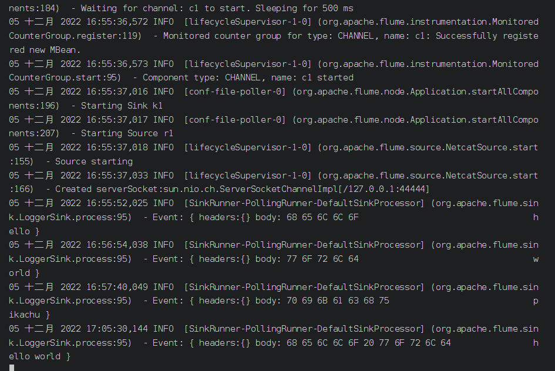

回车,留出空白便于观察

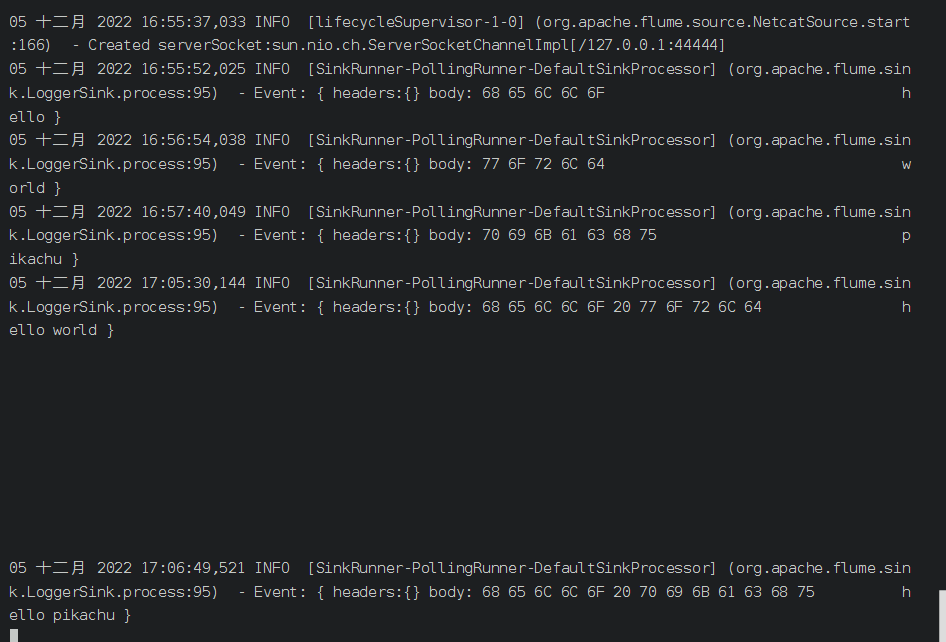

# Linux nohup 命令

**nohup** 英文全称 no hang up（不挂起），用于在系统后台不挂断地运行命令，退出终端不会影响程序的运行。

**nohup** 命令，在默认情况下（非重定向时），会输出一个名叫 nohup.out 的文件到当前目录下，如果当前目录的 nohup.out
文件不可写，输出重定向到 **$HOME/nohup.out** 文件中。

### 使用权限

所有使用者

### 语法格式

```
 nohup Command [ Arg … ] [　& ]
```

### 参数说明：

**Command**：要执行的命令。

**Arg**：一些参数，可以指定输出文件。

**&**：让命令在后台执行，终端退出后命令仍旧执行。

### 实例

以下命令在后台执行 root 目录下的 runoob.sh 脚本：

```
nohup /root/runoob.sh &
```

在终端如果看到以下输出说明运行成功：

```
appending output to nohup.out
```

这时我们打开 root 目录 可以看到生成了 nohup.out 文件。

如果要停止运行，你需要使用以下命令查找到 nohup 运行脚本到 PID，然后使用 kill 命令来删除：

```
ps -aux | grep "runoob.sh" 
```

参数说明：

- **a** : 显示所有程序
- **u** : 以用户为主的格式来显示
- **x** : 显示所有程序，不区分终端机

另外也可以使用 **ps -def | grep "runoob.sh**" 命令来查找。

找到 PID 后，就可以使用 kill PID 来删除。

```
kill -9  进程号PID
```

以下命令在后台执行 root 目录下的 runoob.sh 脚本，并重定向输入到 runoob.log 文件：

```
nohup /root/runoob.sh > runoob.log 2>&1 &
```

**2>&1** 解释：

将标准错误 2 重定向到标准输出 &1 ，标准输出 &1 再被重定向输入到 runoob.log 文件中。

- 0 – stdin (standard input，标准输入)
- 1 – stdout (standard output，标准输出)
- 2 – stderr (standard error，标准错误输出)

# 反射

## Java中TypeReference用法说明

### 用途

在使用[fastJson](https://so.csdn.net/so/search?q=fastJson&spm=1001.2101.3001.7020)时,对于泛型的**反序列化**
很多场景下都会使用到TypeReference，例如：

```java
    public<T> T getData(TypeReference<T> typeReference){
        Object data=this.get("data");
        String jsonStr=JSONUtil.toJsonStr(data);
        return JSONUtil.toBean(jsonStr,typeReference,false);
        }

public R setData(Object data){
        this.put("data",data);
        return this;
        }
@Test
public void test4(){
        R r=new R();
        r.setData(Arrays.asList(1,2,3,4,5));
        List<String> data=r.getData(new TypeReference<List<String>>(){
        });
        System.out.println(data);
        }
```

输出:

```java
[1,2,3,4,5]
```

### 关于public <T> T method(T t)函数的说明

```java
public<T> T method(T t){
        // CODE
        return t;
        }
```

上面的代码，在public和method之间有两个部分<T>和T。

其中<T>是为了定义当前我有一个 范型变量类型，类型名使用T来表示，而第二部分T，表示method这个函数的返回值类型为T，其中的<T>
只是为了在[函数声明](https://so.csdn.net/so/search?q=函数声明&spm=1001.2101.3001.7020)前，定义一种范型；因此下面的函数也是合法的：

**正确实例:**

```java
public<T> int method1(T t){
        // CODE
        return 1;
        }
```

上面的函数，<T>也是为了定义一种范型，用来提前声明形参的类型是一个范型变量。

正确实例:

```java
    public<K, V> Map<K, V> test5(K key,V value){
        HashMap<K, V> kvHashMap=new HashMap<>();
        kvHashMap.put(key,value);
        return kvHashMap;
        }
```

相反的，在使用自定义的范型T之前，如果不首先使用<T>来声明范型变量的存在的话，编译器会有错误提示：

**［错误示例］－（没有声明范型变量类型T）**

```java
public T method(T t){
        // CODE
        return t;
        }
```

**［错误示例］－（没有声明范型变量类型T）**

```java
public int method(T t){
        // CODE
        return 1;
        }
```

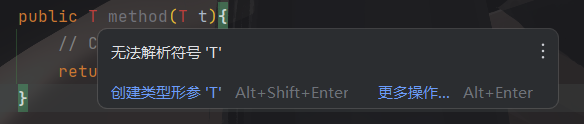

使用TypeReference可以明确的指定[反序列化](https://so.csdn.net/so/search?q=反序列化&spm=1001.2101.3001.7020)
的类型，具体实现逻辑参考TypeReference的构造函数

```java
protected TypeReference(){
        Type superClass=getClass().getGenericSuperclass();

        Type type=((ParameterizedType)superClass).getActualTypeArguments()[0];

        Type cachedType=classTypeCache.get(type);
        if(cachedType==null){
        classTypeCache.putIfAbsent(type,type);
        cachedType=classTypeCache.get(type);
        }

        this.type=cachedType;
        }
```

### 解说

其中核心的方法是：getActualTypeArguments，它可以得到父类的反省类型

ParameterizedType是一个记录类型泛型的接口, 继承自Type,一共三方法:

- Type[] getActualTypeArguments(); //返回泛型类型数组
- Type getRawType(); //返回原始类型Type
- Type getOwnerType(); //返回 Type 对象，表示此类型是其成员之一的类型。

例如 `Map<String,String>` 对应的ParameterizedType三个方法分别取值如下:

- [class java.lang.String, class java.lang.String]
- interface java.util.Map
- null

### 例证

```java
import java.lang.reflect.ParameterizedType;
import java.lang.reflect.Type;
import java.util.HashMap;
import java.util.Map;

public class TypeReferencBaseLearn {
    public static class IntMap extends HashMap<String, Integer> {
    }

    void test1() {
        IntMap intMap = new IntMap();
        System.out.println("getSuperclass:" + intMap.getClass().getSuperclass());
        System.out.println("getGenericSuperclass:" + intMap.getClass().getGenericSuperclass());
        Type type = intMap.getClass().getGenericSuperclass();
        if (type instanceof ParameterizedType) {
            ParameterizedType p = (ParameterizedType) type;
            for (Type t : p.getActualTypeArguments()) {
                System.out.println(t);
            }
        }
    }
    /*
        getSuperclass:class java.util.HashMap
        getGenericSuperclass:java.util.HashMap<java.lang.String, java.lang.Integer>
        class java.lang.String
        class java.lang.Integer
    */

    void test2() {
        Map<String, Integer> intMap = new HashMap<>();
        System.out.println("\ngetSuperclass:" + intMap.getClass().getSuperclass());
        System.out.println("getGenericSuperclass:" + intMap.getClass().getGenericSuperclass());
        Type type = intMap.getClass().getGenericSuperclass();
        if (type instanceof ParameterizedType) {
            ParameterizedType p = (ParameterizedType) type;
            for (Type t : p.getActualTypeArguments()) {
                System.out.println(t);
            }
        }
    }
    /*
        getSuperclass:class java.util.AbstractMap
        getGenericSuperclass:java.util.AbstractMap<K, V>
        K
        V
    */

    void test3() {
        Map<String, Integer> intMap = new HashMap<String, Integer>() {
        };
        System.out.println("\ngetSuperclass:" + intMap.getClass().getSuperclass());
        System.out.println("getGenericSuperclass:" + intMap.getClass().getGenericSuperclass());
        Type type = intMap.getClass().getGenericSuperclass();
        if (type instanceof ParameterizedType) {
            ParameterizedType p = (ParameterizedType) type;
            for (Type t : p.getActualTypeArguments()) {
                System.out.println(t);
            }
        }
    }

    /*
   getSuperclass:class java.util.HashMap
   getGenericSuperclass:java.util.HashMap<java.lang.String, java.lang.Integer>
   class java.lang.String
   class java.lang.Integer　
   */
    public static void main(String[] args) {
        TypeReferencBaseLearn obj = new TypeReferencBaseLearn();
        obj.test1();
        obj.test2();
        obj.test3();
    }
}
```

# SMS短信发送

以阿里云为例,官方api为准

导入依赖

```xml
        <!--        短信验证码       -->
<!-- 异步-->
<dependency>
    <groupId>com.aliyun</groupId>
    <artifactId>alibabacloud-dysmsapi20170525</artifactId>
    <version>2.0.22</version>
</dependency>
        <!--同步-->
<dependency>
<groupId>com.aliyun</groupId>
<artifactId>dysmsapi20170525</artifactId>
<version>2.0.23</version>
</dependency>
```

抽取工具类

```java

@Configuration
@ConfigurationProperties(prefix = "alibaba.cloud.sms")
@Data
public class SmsConfig {
    private String accessKeyId;
    private String accessKeySecret;

    /**
     * 异步短信发送客户端
     */
    @Bean
    public AsyncClient asyncClient() {
        // Configure Credentials authentication information, including ak, secret, token
        StaticCredentialProvider provider = StaticCredentialProvider.create(Credential.builder()
                .accessKeyId(accessKeyId)
                .accessKeySecret(accessKeySecret)
                //.securityToken("<your-token>") // use STS token
                .build());

        // Configure the Client
        AsyncClient client = AsyncClient.builder()
                .region("cn-hangzhou") // Region ID
                //.httpClient(httpClient) // Use the configured HttpClient, otherwise use the default HttpClient (Apache HttpClient)
                .credentialsProvider(provider)
                //.serviceConfiguration(Configuration.create()) // Service-level configuration
                // Client-level configuration rewrite, can set Endpoint, Http request parameters, etc.
                .overrideConfiguration(
                        ClientOverrideConfiguration.create()
                                .setEndpointOverride("dysmsapi.aliyuncs.com")
                        //.setConnectTimeout(Duration.ofSeconds(30))
                ).build();
        return client;
    }

    /**
     * 同步短信发送客户端
     */
    @Bean
    public Client createClient() throws Exception {
        Config config = new Config()
                // 必填，您的 AccessKey ID
                .setAccessKeyId(accessKeyId)
                // 必填，您的 AccessKey Secret
                .setAccessKeySecret(accessKeySecret);
        // 访问的域名
        config.endpoint = "dysmsapi.aliyuncs.com";
        return new Client(config);
    }
}
```

需要在yaml文件中配置sms发送的授权accessKeyId,accessKeySecret

异步发送,同步发送:

```java
    @GetMapping("sendAsync")
public R sendAsync(@RequestParam("phone") String phone,@RequestParam("code") String code){
        if(StringUtils.isEmpty(phone)||StringUtils.isEmpty(code)){
        return R.error(BaseException.MISS_ERROR.getCode(),
        BaseException.MISS_ERROR.getMsg());
        }
        try{
        // Parameter settings for API request
        SendSmsRequest sendSmsRequest=SendSmsRequest.builder()
        .signName("阿里云短信测试")
        .templateCode("SMS_154950909")
        .phoneNumbers(phone)
        .templateParam("{\"code\":\""+code+"\"}")
        // Request-level configuration rewrite, can set Http request parameters, etc.
        // .requestConfiguration(RequestConfiguration.create().setHttpHeaders(new HttpHeaders()))
        .build();
        // Asynchronously get the return value of the API request
        CompletableFuture<SendSmsResponse> response=asyncClient.sendSms(sendSmsRequest);
        // Synchronously get the return value of the API request
        SendSmsResponseBody body=response.get().getBody();
        boolean resultCode="OK".equalsIgnoreCase(body.getCode());
        return resultCode?R.ok():R.ok(body.getMessage()).put("code",BaseException.OTHER_ERROR.getCode());
        }catch(ExecutionException|InterruptedException e){
        log.error(e.getMessage());
        return R.error();
        }finally{
        // Finally, close the client
        asyncClient.close();
        }
        }

@GetMapping("send")
public R send(@RequestParam("phone") String phone,@RequestParam("code") String code){
        if(StringUtils.isEmpty(phone)||StringUtils.isEmpty(code)){
        return R.error(BaseException.MISS_ERROR.getCode(),
        BaseException.MISS_ERROR.getMsg());
        }
        // 工程代码泄露可能会导致AccessKey泄露，并威胁账号下所有资源的安全性。以下代码示例仅供参考，建议使用更安全的 STS 方式，更多鉴权访问方式请参见：https://help.aliyun.com/document_detail/378657.html
        com.aliyun.dysmsapi20170525.models.SendSmsRequest sendSmsRequest=new com.aliyun.dysmsapi20170525.models.SendSmsRequest()
        .setSignName("阿里云短信测试")
        .setTemplateCode("SMS_154950909")
        .setPhoneNumbers(phone)
        .setTemplateParam("{\"code\":\""+code+"\"}");
        com.aliyun.teautil.models.RuntimeOptions runtime=new com.aliyun.teautil.models.RuntimeOptions();
        try{
        // 复制代码运行请自行打印 API 的返回值
        com.aliyun.dysmsapi20170525.models.SendSmsResponse response=client.sendSmsWithOptions(sendSmsRequest,runtime);
        boolean resultCode="OK".equalsIgnoreCase(response.body.getCode());
        return resultCode?R.ok():R.ok(response.body.getMessage()).put("code",BaseException.OTHER_ERROR.getCode());
        }catch(Exception e){
        log.error(e.getMessage());
        }
        return R.error(BaseException.OTHER_ERROR.getCode(),BaseException.OTHER_ERROR.getMsg());
        }
```

# SpringSession

## 使用

依赖:

```xml
        <!--   spring-session共享    -->
<dependency>
    <groupId>org.springframework.session</groupId>
    <artifactId>spring-session-data-redis</artifactId>
</dependency>
        <!--        redis   -->
<dependency>
<groupId>org.springframework.boot</groupId>
<artifactId>spring-boot-starter-data-redis</artifactId>
</dependency>
```

配置:

```properties
spring.session.store-type=redis # Session store type.
server.servlet.session.timeout=# Session timeout. If a duration suffix is not specified, seconds is used.
spring.session.redis.flush-mode=on_save # Sessions flush mode.
spring.session.redis.namespace=spring:session # Namespace for keys used to store sessions.
```

```properties
spring.redis.host=localhost # Redis server host.
spring.redis.password=# Login password of the redis server.
spring.redis.port=6379 # Redis server port.
```

```java

@EnableRedisHttpSession
public class SpringSessionConfig {
    @Bean
    public CookieSerializer cookieSerializer() {
        DefaultCookieSerializer serializer = new DefaultCookieSerializer();
        serializer.setCookieName("PIKACHU");
        //子域共享session
        serializer.setDomainName("gulimall.com");
        return serializer;
    }

    @Bean
    public RedisSerializer<Object> springSessionDefaultRedisSerializer() {
        return RedisSerializer.json();
    }

    @Bean
    public LettuceConnectionFactory connectionFactory() {
        return new LettuceConnectionFactory();
    }
}
```

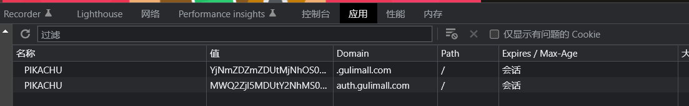

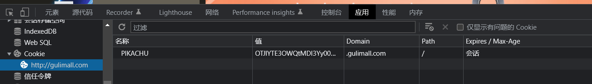

## 原理

## Cookie和Session的区别

**一、共同之处：**
cookie和session都是用来跟踪浏览器用户身份的会话方式。

**二、工作原理：**
**1.Cookie的工作原理**
（1）浏览器端第一次发送请求到服务器端
（2）服务器端创建Cookie，该Cookie中包含用户的信息，然后将该Cookie发送到浏览器端
（3）浏览器端再次访问服务器端时会携带服务器端创建的Cookie
（4）服务器端通过Cookie中携带的数据区分不同的用户
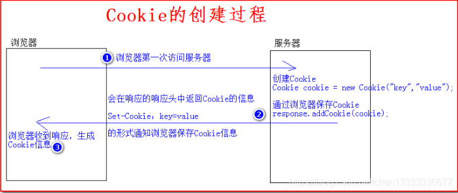
**2.Session的工作原理**
（1）浏览器端第一次发送请求到服务器端，服务器端创建一个Session，同时会创建一个特殊的Cookie（name为JSESSIONID的固定值，value为session对象的ID），然后将该Cookie发送至浏览器端
（2）浏览器端发送第N（N>1）次请求到服务器端,浏览器端访问服务器端时就会携带该name为JSESSIONID的Cookie对象
（3）服务器端根据name为JSESSIONID的Cookie的value(sessionId),去查询Session对象，从而区分不同用户。
name为JSESSIONID的Cookie不存在（**关闭或更换浏览器**），返回1中重新去创建Session与特殊的Cookie
name为JSESSIONID的Cookie存在，根据value中的SessionId去寻找session对象
value为SessionId不存在**（Session对象默认存活30分钟）**，返回1中重新去创建Session与特殊的Cookie
value为SessionId存在，返回session对象
**Session的工作原理图**
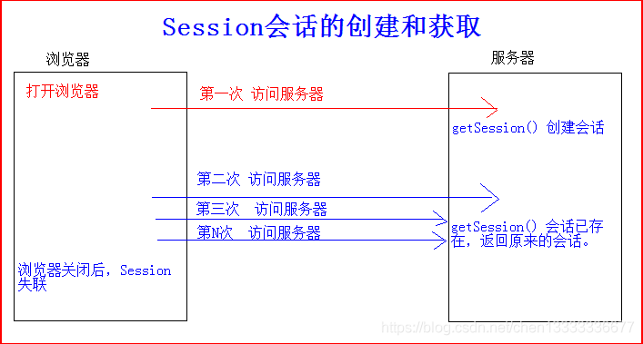
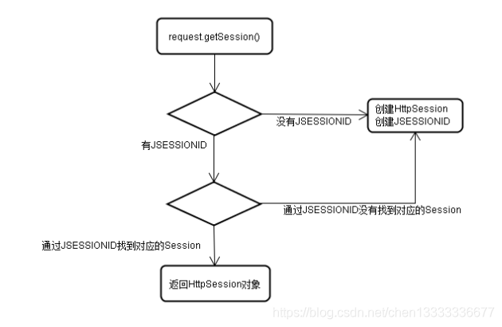
**三、区别：**

cookie数据保存在客户端，session数据保存在服务端。

session
简单的说，当你登陆一个网站的时候，如果web服务器端使用的是session，那么所有的数据都保存在服务器上，客户端每次请求服务器的时候会发送当前会话sessionid，服务器根据当前sessionid判断相应的用户数据标志，以确定用户是否登陆或具有某种权限。由于数据是存储在服务器上面，所以你不能伪造。

cookie
sessionid是服务器和客户端连接时候随机分配的，如果浏览器使用的是cookie，那么所有数据都保存在浏览器端，比如你登陆以后，服务器设置了cookie用户名，那么当你再次请求服务器的时候，浏览器会将用户名一块发送给服务器，这些变量有一定的特殊标记。服务器会解释为cookie变量，所以只要不关闭浏览器，那么cookie变量一直是有效的，所以能够保证长时间不掉线。

如果你能够截获某个用户的cookie变量，然后伪造一个数据包发送过去，那么服务器还是 认为你是合法的。所以，使用cookie被攻击的可能性比较大。

如果cookie设置了有效值，那么cookie会保存到客户端的硬盘上，下次在访问网站的时候，浏览器先检查有没有cookie，如果有的话，读取cookie，然后发送给服务器。

所以你在机器上面保存了某个论坛cookie，有效期是一年，如果有人入侵你的机器，将你的cookie拷走，放在他机器下面，那么他登陆该网站的时候就是用你的身份登陆的。当然，伪造的时候需要注意，直接copy
cookie文件到 cookie目录，浏览器是不认的，他有一个index.dat文件，存储了 cookie文件的建立时间，以及是否有修改，所以你必须先要有该网站的
cookie文件，并且要从保证时间上骗过浏览器

两个都可以用来存私密的东西，session过期与否，取决于服务器的设定。cookie过期与否，可以在cookie生成的时候设置进去。

**四、区别对比：**
(1)cookie数据存放在客户的浏览器上，session数据放在服务器上
(2)cookie不是很安全，别人可以分析存放在本地的COOKIE并进行COOKIE欺骗,如果主要考虑到安全应当使用session
(3)session会在一定时间内保存在服务器上。当访问增多，会比较占用你服务器的性能，如果主要考虑到减轻服务器性能方面，应当使用COOKIE
(4)单个cookie在客户端的限制是3K，就是说一个站点在客户端存放的COOKIE不能3K。
(5)所以：将登陆信息等重要信息存放为SESSION;其他信息如果需要保留，可以放在COOKIE中

# OAuth2

## OAuth2 认证基本流程

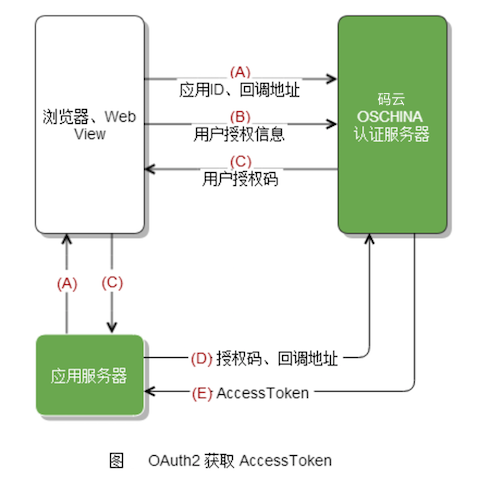

## OAuth2 获取 AccessToken 认证步骤

### 1. 授权码模式

- 应用通过 浏览器 或 Webview 将用户引导到码云三方认证页面上（ **GET请求
  ** ）`https://gitee.com/oauth/authorize?client_id={client_id}&redirect_uri={redirect_uri}&response_type=code`
- 用户对应用进行授权
  注意: 如果之前已经授权过的需要跳过授权页面，需要在上面第一步的 URL 加上 scope 参数，且 scope
  的值需要和用户上次授权的勾选的一致。如用户在上次授权了user_info、projects以及pull_requests。则步骤A 中 GET
  请求应为：`https://gitee.com/oauth/authorize?client_id={client_id}&redirect_uri={redirect_uri}&response_type=code&scope=user_info%20projects%20pull_requests`
    - 码云认证服务器通过回调地址{redirect_uri}将 用户授权码 传递给 应用服务器 或者直接在 Webview 中跳转到携带
      用户授权码的回调地址上，Webview 直接获取code即可（{redirect_uri}?code=abc&state=xyz)
- 应用服务器 或 Webview 使用 access_token API 向 码云认证服务器发送post请求传入 用户授权码 以及 回调地址（ **POST请求** ）
  **注：请求过程建议将 client_secret 放在 Body 中传值，以保证数据安全。
  **`https://gitee.com/oauth/token?grant_type=authorization_code&code={code}&client_id={client_id}&redirect_uri={redirect_uri}&client_secret={client_secret}`
- 码云认证服务器返回 access_token
  应用通过 access_token 访问 Open API 使用用户数据。
- 当 access_token 过期后（有效期为一天），你可以通过以下 refresh_token 方式重新获取 access_token（ **POST请求
  ** ）`https://gitee.com/oauth/token?grant_type=refresh_token&refresh_token={refresh_token}`
- 注意：如果获取 access_token 返回 403，可能是没有设置User-Agent的原因。
  详见：[获取Token时服务端响应状态403是什么情况](https://gitee.com/oschina/git-osc/issues/IDBSA)

### 2. 密码模式

- 用户向客户端提供邮箱地址和密码。客户端将邮箱地址和密码发给码云认证服务器，并向码云认证服务器请求令牌。（ *
  *POST请求。Content-Type: application/x-www-form-urlencoded
  ** ）`curl -X POST --data-urlencode "grant_type=password" --data-urlencode "username={email}" --data-urlencode "password={password}" --data-urlencode "client_id={client_id}" --data-urlencode "client_secret={client_secret}" --data-urlencode "scope=projects user_info issues notes" https://gitee.com/oauth/token`
  scope表示权限范围，有以下选项，请求时使用空格隔开`user_info projects pull_requests issues notes keys hook groups gists enterprises`
- 码云认证服务器返回 access_token
  应用通过 access_token 访问 Open API 使用用户数据。

## 创建应用流程

- 在 **[修改资料](https://gitee.com/profile)** -> **[第三方应用](https://gitee.com/oauth/applications)**
  ，创建要接入码云的应用。 
- 填写应用相关信息，勾选应用所需要的权限。其中: **回调地址**
  是用户授权后，码云回调到应用，并且回传授权码的地址。 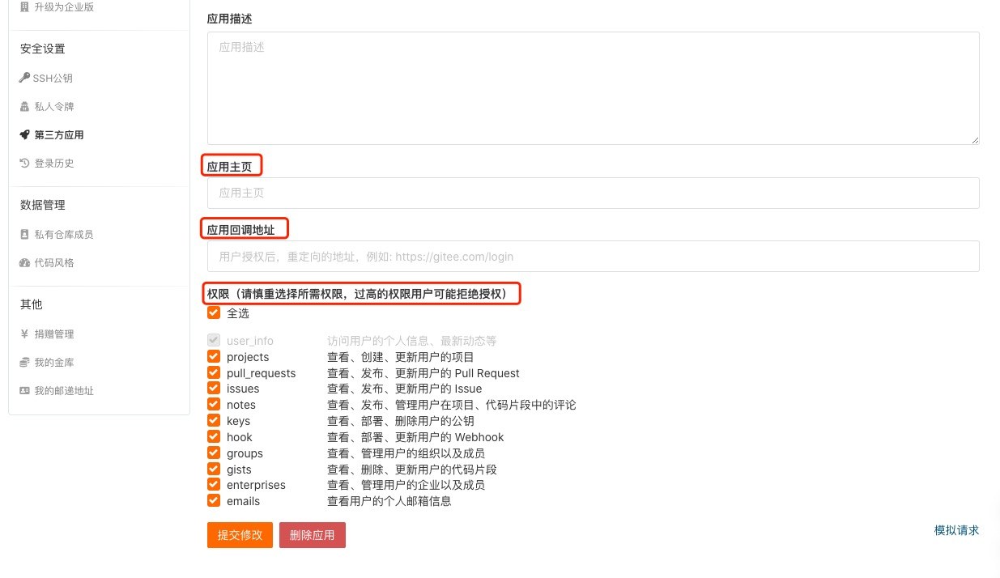
- 创建成功后，会生成 **Cliend ID** 和 **Client Secret**。他们将会在上述OAuth2
  认证基本流程用到。 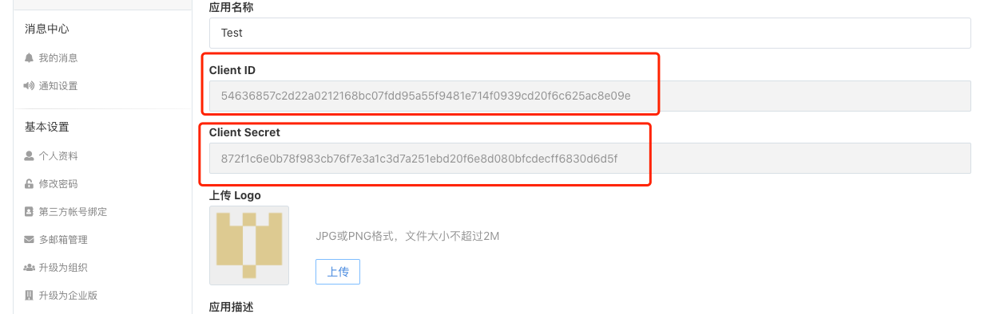

# 单点登录（SSO）

单点登录英文全称Single Sign On，简称就是SSO。它的解释是：**在多个应用系统中，只需要登录一次，就可以访问其他相互信任的应用系统。
**


如图所示，图中有4个系统，分别是Application1、Application2、Application3、和SSO。Application1、Application2、Application3没有登录模块，而SSO只有登录模块，没有其他的业务模块，当Application1、Application2、Application3需要登录时，将跳到SSO系统，SSO系统完成登录，其他的应用系统也就随之登录了。这完全符合我们对单点登录（SSO）的定义。

## 技术实现

在说单点登录（SSO）的技术实现之前，我们先说一说普通的登录认证机制。


如上图所示，我们在浏览器（Browser）中访问一个应用，这个应用需要登录，我们填写完用户名和密码后，完成登录认证。这时，我们在这个用户的session中标记登录状态为yes（已登录），同时在浏览器（Browser）中写入Cookie，这个Cookie是这个用户的唯一标识。下次我们再访问这个应用的时候，请求中会带上这个Cookie，服务端会根据这个Cookie找到对应的session，通过session来判断这个用户是否登录。如果不做特殊配置，这个Cookie的名字叫做jsessionid，值在服务端（server）是唯一的。

## 同域下的单点登录

一个企业一般情况下只有一个域名，通过二级域名区分不同的系统。比如我们有个域名叫做：a.com，同时有两个业务系统分别为：app1.a.com和app2.a.com。我们要做单点登录（SSO），需要一个登录系统，叫做：sso.a.com。

我们只要在sso.a.com登录，app1.a.com和app2.a.com就也登录了。通过上面的登陆认证机制，我们可以知道，在sso.a.com中登录了，其实是在sso.a.com的服务端的session中记录了登录状态，同时在浏览器端（Browser）的sso.a.com下写入了Cookie。那么我们怎么才能让app1.a.com和app2.a.com登录呢？这里有两个问题：

- Cookie是不能跨域的，我们Cookie的domain属性是sso.a.com，在给app1.a.com和app2.a.com发送请求是带不上的。
- sso、app1和app2是不同的应用，它们的session存在自己的应用内，是不共享的。


那么我们如何解决这两个问题呢？针对第一个问题，sso登录以后，可以将Cookie的域设置为顶域，即.a.com，这样所有子域的系统都可以访问到顶域的Cookie。
**我们在设置Cookie时，只能设置顶域和自己的域，不能设置其他的域。比如：我们不能在自己的系统中给baidu.com的域设置Cookie。**

Cookie的问题解决了，我们再来看看session的问题。我们在sso系统登录了，这时再访问app1，Cookie也带到了app1的服务端（Server），app1的服务端怎么找到这个Cookie对应的Session呢？这里就要把3个系统的Session共享，如图所示。共享Session的解决方案有很多，例如：Spring-Session。这样第2个问题也解决了。

同域下的单点登录就实现了，**但这还不是真正的单点登录。**

## 不同域下的单点登录

同域下的单点登录是巧用了Cookie顶域的特性。如果是不同域呢？不同域之间Cookie是不共享的，怎么办？

这里我们就要说一说CAS流程了，这个流程是单点登录的标准流程。


上图是CAS官网上的标准流程，具体流程如下：

1. 用户访问app系统，app系统是需要登录的，但用户现在没有登录。
2. 跳转到CAS server，即SSO登录系统，**以后图中的CAS Server我们统一叫做SSO系统。** SSO系统也没有登录，弹出用户登录页。
3. 用户填写用户名、密码，SSO系统进行认证后，将登录状态写入SSO的session，浏览器（Browser）中写入SSO域下的Cookie。
4. SSO系统登录完成后会生成一个ST（Service Ticket），然后跳转到app系统，同时将ST作为参数传递给app系统。
5. app系统拿到ST后，从后台向SSO发送请求，验证ST是否有效。
6. 验证通过后，app系统将登录状态写入session并设置app域下的Cookie。

至此，跨域单点登录就完成了。以后我们再访问app系统时，app就是登录的。接下来，我们再看看访问app2系统时的流程。

1. 用户访问app2系统，app2系统没有登录，跳转到SSO。
2. 由于SSO已经登录了，不需要重新登录认证。
3. SSO生成ST，浏览器跳转到app2系统，并将ST作为参数传递给app2。
4. app2拿到ST，后台访问SSO，验证ST是否有效。
5. 验证成功后，app2将登录状态写入session，并在app2域下写入Cookie。

这样，app2系统不需要走登录流程，就已经是登录了。SSO，app和app2在不同的域，它们之间的session不共享也是没问题的。

*
*有的同学问我，SSO系统登录后，跳回原业务系统时，带了个参数ST，业务系统还要拿ST再次访问SSO进行验证，觉得这个步骤有点多余。他想SSO登录认证通过后，通过回调地址将用户信息返回给原业务系统，原业务系统直接设置登录状态，这样流程简单，也完成了登录，不是很好吗？
**

**其实这样问题时很严重的，如果我在SSO没有登录，而是直接在浏览器中敲入回调的地址，并带上伪造的用户信息，是不是业务系统也认为登录了呢？这是很可怕的。
**

## 总结

单点登录（SSO）的所有流程都介绍完了，原理大家都清楚了。总结一下单点登录要做的事情：

- **单点登录（SSO系统）是保障各业务系统的用户资源的安全 。**
- **各个业务系统获得的信息是，这个用户能不能访问我的资源。**
- **单点登录，资源都在各个业务系统这边，不在SSO那一方。 用户在给SSO服务器提供了用户名密码后，作为业务系统并不知道这件事。
  SSO随便给业务系统一个ST，那么业务系统是不能确定这个ST是用户伪造的，还是真的有效，所以要拿着这个ST去SSO服务器再问一下，这个用户给我的ST是否有效，是有效的我才能让这个用户访问。
  **

## 解决方案

**Sa-Token** 是一个轻量级 Java 权限认证框架，主要解决：登录认证、权限认证、单点登录、OAuth2.0、分布式Session会话、微服务网关鉴权
等一系列权限相关问题。

https://gitee.com/dromara/sa-token

# 支付

## 支付宝

sdk

```xml
        <!--   支付宝     -->
<dependency>
    <groupId>com.alipay.sdk</groupId>
    <artifactId>alipay-sdk-java</artifactId>
    <version>4.35.37.ALL</version>
</dependency>
```

config

```java

@ConfigurationProperties(prefix = "alipay")
@Configuration
@Data
public class AlipayTemplate {
    /**
     * 在支付宝创建的应用的id
     */
    private String appId;

    /**
     * 商户私钥，您的PKCS8格式RSA2私钥
     */
    private String merchantPrivateKey;
    /**
     * 支付宝公钥,查看地址：https://openhome.alipay.com/platform/keyManage.htm 对应APPID下的支付宝公钥。
     */
    private String alipayPublicKey;
    /**
     * 服务器[异步通知]页面路径  需http://格式的完整路径，不能加?id=123这类自定义参数，必须外网可以正常访问
     * 支付宝会悄悄的给我们发送一个请求，告诉我们支付成功的信息
     */
    private String notifyUrl;
    /**
     * 页面跳转同步通知页面路径 需http://格式的完整路径，不能加?id=123这类自定义参数，必须外网可以正常访问
     * 同步通知，支付成功，一般跳转到成功页
     */
    private String returnUrl;
    /**
     * 签名方式
     */
    private String signType = "RSA2";
    /**
     * 字符编码格式
     */
    private String charset = "utf-8";
    /**
     * 支付宝网关； https://openapi.alipaydev.com/gateway.do
     */
    private String gatewayUrl;
    /**
     * 支付超时关单
     */
    private String timeoutExpress = "3m";

    public String pay(PayVo vo) throws AlipayApiException {
        System.out.println("app_id = " + appId);
        //1、根据支付宝的配置生成一个支付客户端
        AlipayClient alipayClient = new DefaultAlipayClient(gatewayUrl, appId, merchantPrivateKey, "json", charset, alipayPublicKey, signType);

        //2、创建一个支付请求 //设置请求参数
        AlipayTradePagePayRequest alipayRequest = new AlipayTradePagePayRequest();
        alipayRequest.setReturnUrl(returnUrl);
        alipayRequest.setNotifyUrl(notifyUrl);

        //商户订单号，商户网站订单系统中唯一订单号，必填
        String outTradeNo = vo.getOut_trade_no();
        //付款金额，必填
        String totalAmount = vo.getTotal_amount();
        //订单名称，必填
        String subject = vo.getSubject();
        //商品描述，可空
        String body = vo.getBody();
        HashMap<String, String> map = new HashMap<>();
        map.put("out_trade_no", outTradeNo);
        map.put("total_amount", totalAmount);
        map.put("subject", subject);
        map.put("body", body);
        map.put("product_code", "FAST_INSTANT_TRADE_PAY");
        map.put("timeout_express", timeoutExpress);
        alipayRequest.setBizContent(JSON.toJSONString(map));
        String result = alipayClient.pageExecute(alipayRequest).getBody();

        //会收到支付宝的响应，响应的是一个页面，只要浏览器显示这个页面，就会自动来到支付宝的收银台页面
//        System.out.println("支付宝的响应：" + result);
        return result;
    }
}
```

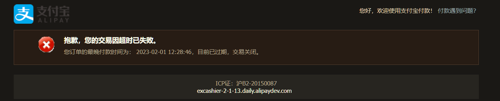

支付成功异步通知验证签名:

```java
    private boolean isSignVerified(HttpServletRequest request)throws AlipayApiException{
        //获取支付宝POST过来反馈信息
        Map<String, String> params=new HashMap<>();
        Map requestParams=request.getParameterMap();
        for(Iterator iter=requestParams.keySet().iterator();iter.hasNext();){
        String name=(String)iter.next();
        String[]values=(String[])requestParams.get(name);
        String valueStr="";
        for(int i=0;i<values.length;i++){
        valueStr=(i==values.length-1)?valueStr+values[i]
        :valueStr+values[i]+",";
        }
        //乱码解决，这段代码在出现乱码时使用。如果mysign和sign不相等也可以使用这段代码转化
//            valueStr = new String(valueStr.getBytes(StandardCharsets.ISO_8859_1), "gbk");
        params.put(name,valueStr);
        }
        //调用SDK验证签名
        return AlipaySignature.rsaCheckV1(params,alipayTemplate.getAlipayPublicKey(),alipayTemplate.getCharset(),alipayTemplate.getSignType());
        }
```

# What‘s your problem

## nacos

背景:引入nacos注册,配置中心

加入日志配置出错:

```yaml
spring:
  cloud:
    nacos:
      server-addr: localhost:9948
logging:
  level:
    com.pika.gstore: debug
```

```java
2022-12-06 00:29:46.503ERROR 16212---[t.remote.worker]c.a.n.c.remote.client.grpc.GrpcClient:Server check fail,please check server localhost,port 9848is available,error={}

        java.util.concurrent.TimeoutException:Waited 3000milliseconds(plus 13milliseconds,78400nanoseconds delay)for com.alibaba.nacos.shaded.io.grpc.stub.ClientCalls$GrpcFuture@1ae23cc0[status=PENDING,info=[GrpcFuture{clientCall={delegate={delegate=ClientCallImpl{method=MethodDescriptor{fullMethodName=Request/request,type=UNARY,idempotent=false,safe=false,sampledToLocalTracing=true,
        ...
```

解决: 将application.yaml改为bootstrap.yaml,或者将nacos的配置移入bootstrap.yaml

## Java

### Stream

java.lang.IllegalStateException: Duplicate key异常解决

使用场景：
在实际应用开发中，会常把一个List的查询数据集合转为一个Map，那么在这里的
list.[stream](https://so.csdn.net/so/search?q=stream&spm=1001.2101.3001.7020)().collect()
其实就是做了这么一件事情，它是java8的stream方式实现的它是以type为key，以entity对象为value构成Map。

```java
    //查询
    List<QuestionCategoryEntity> list=questionCategoryService.selectList(entityWrapper);

        Map<String, String> categoryMap=list.stream().collect(
        Collectors.toMap(
        QuestionCategoryEntity::getCategoryCode,
        QuestionCategoryEntity::getCategoryName
        )
        );
```

在有些业务场景中会出现如下异常：Duplicate key ，map的key重复，如上的 QuestionCategoryEntity::getCategoryCode。

```java
java.lang.IllegalStateException:Duplicate key 专项考试
        at java.util.stream.Collectors.lambda$throwingMerger$0(Collectors.java:133)
        at java.util.HashMap.merge(HashMap.java:1245)
        at java.util.stream.Collectors.lambda$toMap$58(Collectors.java:1320)
        at java.util.stream.ReduceOps$3ReducingSink.accept(ReduceOps.java:169)
        at java.util.ArrayList$ArrayListSpliterator.forEachRemaining(ArrayList.java:1374)
        ......
```

解决方法：
使用toMap()的重载方法，如果已经存在则不再修改，直接使用上一个数据。

```java
    //查询
    List<QuestionCategoryEntity> list=questionCategoryService.selectList(entityWrapper);

        Map<String, String> categoryMap=list.stream().collect(
        Collectors.toMap(
        QuestionCategoryEntity::getCategoryCode,
        QuestionCategoryEntity::getCategoryName,
        (entity1,entity2)->entity1
        )
        );
```

等效于

```java

questionCategoryService.selectList(entityWrapper);

        Map<String, String> categoryMap=list.stream().collect(
        Collectors.toMap(
        QuestionCategoryEntity::getCategoryCode,
        QuestionCategoryEntity::getCategoryName,
        (entity1,entity2){
        return entity1
        }
        )
        );
```

(entity1, entity2) -> entity1 这里使用的箭头函数，也就是说当出现了重复key的数据时，会回调这个方法，可以在这个方法里处理重复Key数据问题，这里粗暴点，直接使用了上一个数据。

## SpringCloud

### Feign

feign调用服务超时feign.RetryableException: Read timed out,需要适当延长远程调用等待时间

添加yml配置

```yml
ribbon:
  ReadTimeout: 60000
  ConnectTimeout: 60000
```


